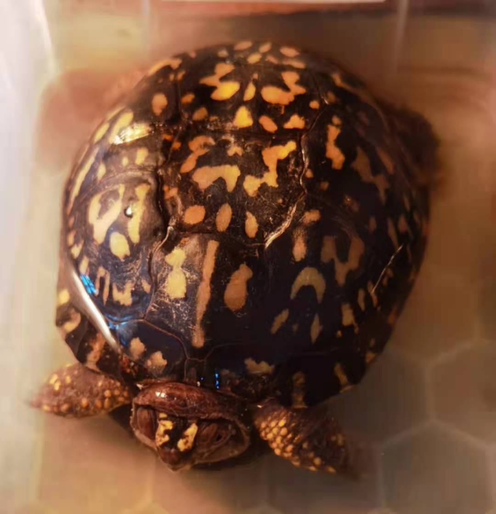

# 东箱摔伤治疗

发布于：2021-06-23

2021-06-22，由于喂食忘了关好龟箱的门，导致图片这只东箱母龟翻出箱子，箱子离地面大概有一米左右的高度，刚摔时反应剧烈，四肢紧缩闭壳，尾部喷射出大量尿液。捡起全身检查没有发现壳子有损伤，仔细观察发现嘴角有少量血液流出，应该是内部出血了。

自己感觉无比懊恼自责，但是这已经是既成事实，只能想办法治疗。

23日下班回家，买了云南白药粉，本来打算直接拌在饲料里面喂，但是因为摔伤现在龟无比胆小，似乎也失去了食欲，喂食服药行不通，只有采用泡水的方式，在大概0.5L水里泡了大概0.5g的云南白药粉，泡了大概有20分钟左右，龟拉了一些粪便。没有观察到明显的出血情况。后续再泡药观察。

