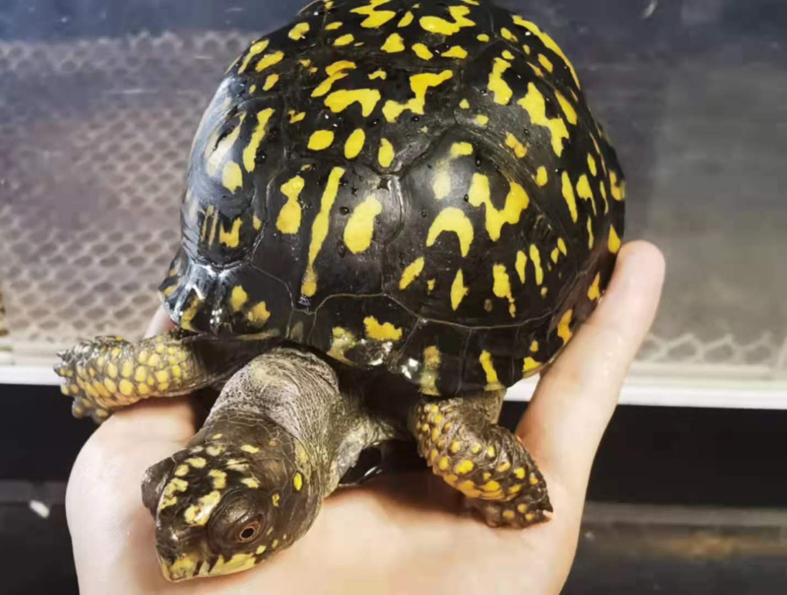
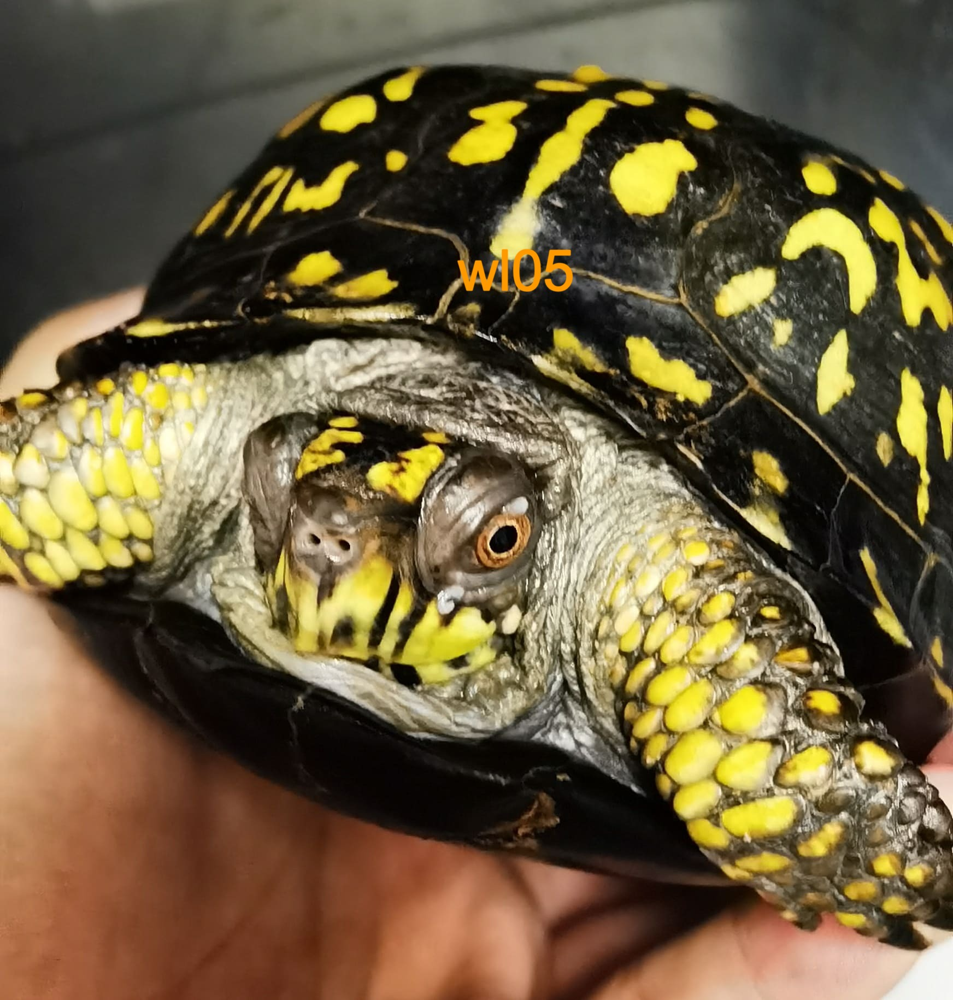
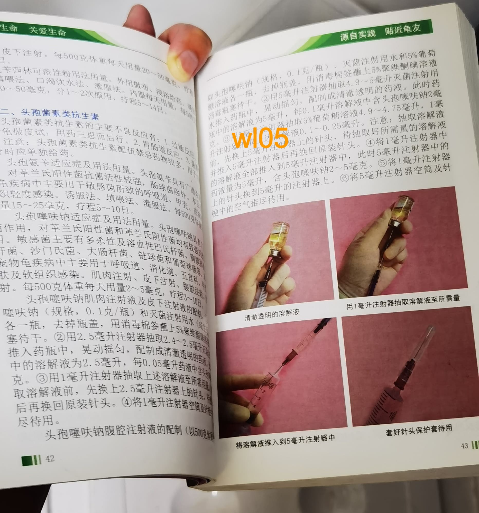
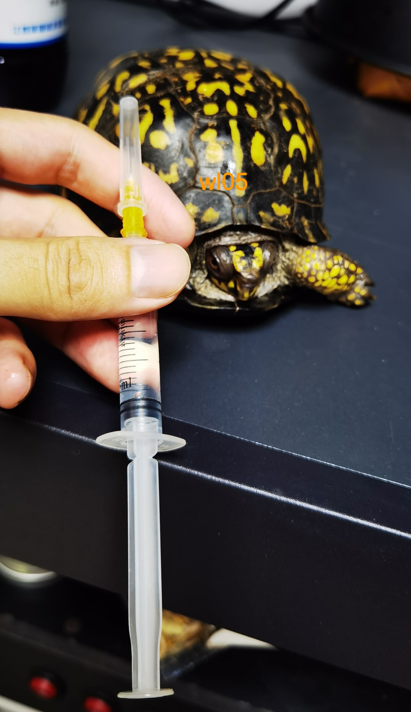
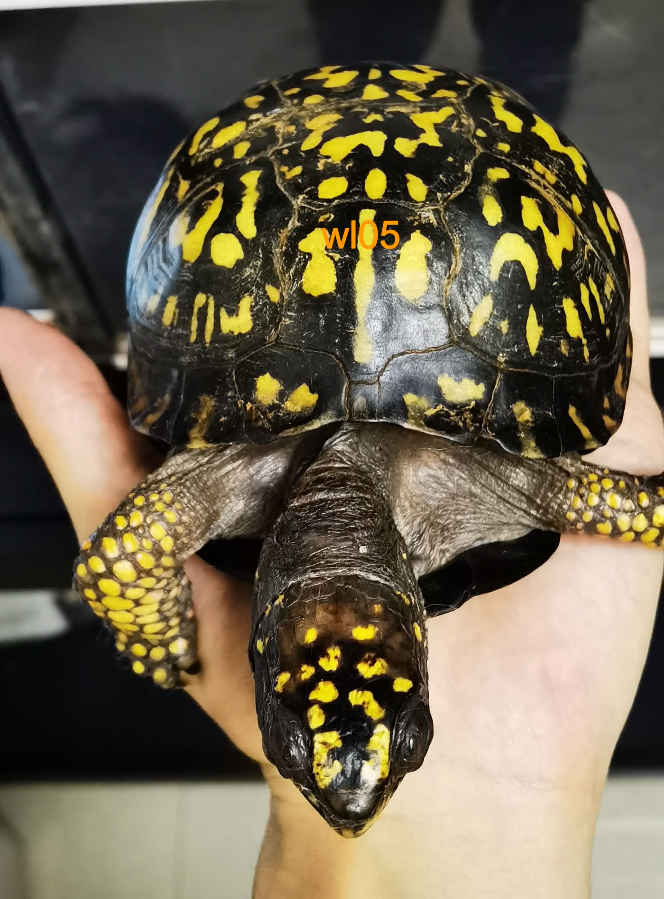

# 东箱摔伤治疗

发布于：2021-06-23

<image-container>
 
</image-container>

2021-06-22，由于喂食忘了关好龟箱的门，导致图片这只东箱母龟翻出箱子，箱子离地面大概有一米左右的高度，刚摔时反应剧烈，四肢紧缩闭壳，尾部喷射出大量尿液。捡起全身检查没有发现壳子有损伤，仔细观察发现嘴角有少量血液流出，应该是内部出血了。

自己感觉无比懊恼自责，但是这已经是既成事实，只能想办法治疗。

23日下班回家，买了云南白药粉，本来打算直接拌在饲料里面喂，但是因为摔伤现在龟无比胆小，似乎也失去了食欲，喂食服药行不通，只有采用泡水的方式，在大概0.5L水里泡了大概0.5g的云南白药粉，泡了大概有20分钟左右，龟拉了一些粪便。没有观察到明显的出血情况。后续再泡药观察。

**06-27更新**

<image-container>
 
</image-container>

泡了几天云南白药粉，感觉状态还可以，但是目前还不吃东西，脖子有明显的肿胀。不知道是内脏受伤了还是受到惊吓暂时不吃东西。很焦灼，再调理几天看看情况。

**07-16更新**

经过快两个星期的观察暂时没有发现特别严重的病情反应，但是龟眼角鼻子会有粘液流出，怀疑体内还是有一定的摔伤感染，准备进行消炎抗菌治疗，同时也是考虑给龟补充体力，准备采用腹腔注射葡萄糖。对于眼睛准备采用左氧氟沙星滴眼液进行治疗。

<image-container>
 
</image-container>
<image-description text="眼睛和鼻子都有粘液分泌"/>
<image-container>
 
</image-container>
<image-description text="参考书籍准备使用头孢塞夫纳抗生素进行注射治疗"/>
<image-container>
 
</image-container>
<image-description text="配药准备打针"/>

**07-20更新**

经过了四天的治疗，龟的精神状态好了很多，脖子上的肿胀也消下去了，眼睛也没有流粘液，但是鼻腔还是有粘液流出，呼吸也有呼噜呼噜的声音。估计内部还是有一定的感染。
<image-container>
 
</image-container>
<image-description text="经过了四天的治疗打了五针"/>
再继续治疗观察几天看看情况。

