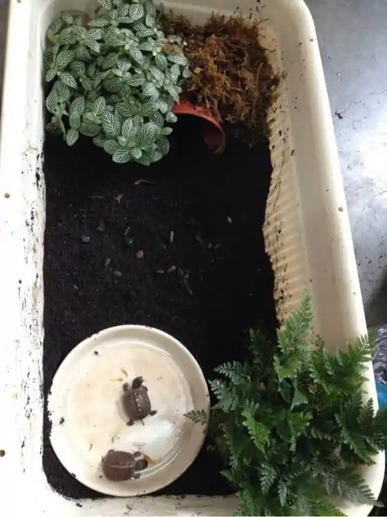

# 箱龟苗饲养篇

<page-tags text="发布于：2021-09-11"></page-tags>

箱龟苗饲养问题，开篇点题，记录一下自己养箱龟苗的一些心得，主要写给箱苗新手玩家，不见得适合每个人，但是我相信还是有一定的参考意义。

笔者15年开始接触箱龟，跟很多玩家一样都是从饲养箱龟苗开始。15-17年之间，前前后后经手的箱龟苗不下十个，但是总体存活率只有60%左右。苗子夭折的原因有很多。我总结了一下大概有以下几种原因：

* 肠炎，（损耗2个）
* 翻车溺水 （损耗1个）
* 翻车被加温灯烤死（损耗1个）

还有一些饲养过程中出现的问题：

* 腐甲（环境高热潮湿不透风）
* 真菌（环境高热潮湿不透风）
* 断尾（环境太干燥，混养被咬）
* 腐皮掉指甲（环境湿度问题）
* 被咬缺壳断尾（混养导致）
* 溺亡（水盆水位太高）

这些都是我作为一个养苗新手遇到过的一系列问题，可见要养出一只品相完好的箱龟还是一件挺不容易的事。

养龟的过程也是一个不断学习不断总结的过程，有问题那就要学习和反思。总结一下导致以上问题的原因无外乎以下几点：

**1. 环境**

箱苗对环境的要求并不高，环境也不需要太大，一般40 * 30 的整理箱就行，可以饲养一到两只苗。箱子里面铺5厘米左右厚的山土，这里笔者建议有条件的玩家去深山里挖一些纯净的山土，箱苗在饲养的过程中难免会吞食一些土壤，纯净的土壤可以给龟提供一些生长过程中必不可少的微量元素（这句话是我瞎编的，😄，猜测应该是有些作用，因为在平时的饲养过程中也发现龟苗有吃土的习惯，我想也是有原因的）。这里不建议直接使用小区花园里面或者马路边上的土，原因很多，比多小区里面经常放蟑螂药老鼠药什么的、经过水泥混杂的土用着也不放心，实在没条件的也可以在网上买一些。苗子一定要提供躲避，躲藏是苗子的天性可以给它们提供安全感，所以环境里面需要提供可以躲避的遮挡物，可以使用瓦片，树叶或者把小花盆对切两半用一半就可以了，其实很多时候苗子会直接往土里钻。这样大体上环境就差不多了。

比较懒或者没有什么时间照看龟的龟友可以加一个水盆，但是要一定要注意，水深不能超过苗子背的高度的一半，龟苗很容易翻车，翻车后又很难翻过来（前车之鉴一定要注意）。这里笔者还是建议定期将苗拿出来泡水，泡水过程中可以对龟进行检查，观察龟苗的状态，排便情况，进行投食等。

下面附上笔者之前布置的环境图：

<image-container>
 
</image-container>
<image-description text="2015年的老图，已经糊得看不清楚了，😂"/>

<image-container>
  
</image-container>
<image-description text="最近布置的养苗环境"/>

这里不得不提一下加温环境的布置。苗子第一年，很多玩家都会选择给龟苗加温过冬以提高存活率。但是这个过程如果把稳不当很容易造成龟苗品相受损甚至夭折。

第一、是加温箱的选择，加温箱一定要选择高度在40厘米以上的，这样加温灯才不至于离龟太近，不容易造成烤龟的惨剧。还有一定要选择一个质量好的温控，切记！

第二、环境的布置，笔者建议还是参考上面的布置方式，一般不会有太大的问题。

第三、温差和喂食，加温喂食一定要特别的注意，之前遇到过一个龟友，冬天加温饲养过程中不知道怎么回事龟苗就肠炎拉稀了，想不明白就来问我，经过仔细询问才发现原来他在给龟泡水的过程中直接使用室内的矿泉水，室内矿泉水只有十几度，龟箱温度30度左右，想想这能不有问题吗。这个例子告诉我们在冬天加温饲养的过程中一定要注意温差，苗子是经不起太大温差的。这里笔者建议不要把龟拿出加温环境，给龟苗一个温度相对稳定的环境。至于说泡水，这里有个小技巧可以分享一下，可以提前在养苗的龟箱里面储备一些水，这样在用水的时候也就不存在温差的问题了。

第四、也是最重要的一点湿度与通风，加温箱里面的环境一定不能太过潮湿，湿度太高加上加温箱又是一个相对封闭的高热环境，很容易形成高热高湿不通风的情况，细菌很容易在这样的环境中滋生，苗子在这种环境下很容易长真菌，腐甲，腐皮等等。这里笔者建议将环境的湿度控制在60%到80%之间，定期对龟箱环境进行消毒。

这样看来，选择一个相对大一些的加温箱其实还是有很多好处的，这里就看个人的选择了。

**2. 多龟混养**

太多龟苗饲养在的一个相对狭小的环境中还是很容易造成问题的。

经过笔者多年的观察发现箱苗对食物并没有太好的区分能力，所以对引起它们食欲的事物都会去咬咬试试，狠起来连自己也咬，这里笔者理解有点像婴儿的口欲期。具有这种行为加上混养，就很容易造成龟苗互咬的问题。所以笔者不建议混养太多，按上面的环境布置，一个环境容纳一到两个就可以了。

**3. 心态**

养龟也是养心态，养境界，养耐心。很多新手玩家，抱着好奇的心态，买到了自己的第一个龟苗，到家就当宝供着。一会儿不去拿出来看看，摆弄摆弄，拍拍照心里就痒痒。还有些龟友怕这怕那喜欢折腾，一会儿泡水一会儿喂食，一会儿加温一会儿室温，一会儿室外一会儿室内。反正就是来来回回的折腾，龟苗本没有问题也会被折腾出问题。

龟首先是自然界的生物，有它固有的生活习性以及抵御风险的能力，没有我们想的那么脆弱，我们要做的是遵循它们本来的习性，因为是在人工环境中所以会有一些必要因素的缺失而我们要做的就是补充这些必要的因素，这些必要因素包括食物，干净的水源，适宜的温度，适宜的湿度，必要的阳光等等，除了这些以外靠我们人的意志强加给它们的东西都有可能造成它们的不适，所以尽量站在龟的角度去看待问题，笔者建议可以看看美国箱龟原生环境的一些视频，多了解一下原生环境的构成，以此来做参考。

总之笔者个人认为，除了给龟提供必要的条件外，尽量不要去干扰和折腾它们。

## 关于苗子开食问题

为什么要单独说这个问题，因为这是饲养箱龟苗的第一个难关，如果你购买的箱龟苗是没有开食的，那么很有可能这个问题会困扰你很久，很有可能会让你抓狂，丧失耐心。但是笔者又想说，这个问题其实是人的问题而不是龟的问题。为什么这样说后面会有解释。先来看看一些常见的开食手法：

* 饲料开食法
* 蚯蚓开食法
* 红虫开食法
* 针头蟋蟀汁抹鼻子和嘴巴
* 面包虫汁抹鼻子和嘴巴
* 其他

似乎饲料开食法在这里面似乎显得有点突兀，可能有龟友会问饲料能开食我就不会有这个问题了，但是笔者大部分饲养过的箱苗其实都是饲料开食的，这个并不是笔者想讨论的重点。

笔者想说的重点是，开食并不是一个问题，很多龟友在讨论这个问题的时候把不开食似乎当成一个病症在讨论，似乎不吃东西是一个很大的问题，龟苗会饿死吗，至今没有听说过。笔者的箱苗都是自然开食，前期不强求它吃东西，只是在泡水的时候用饲料引诱它，不吃就等下一次，一般这个时间不会超过龟龄的三个月，陆陆续续龟苗就会主动吃饲料了。所以其实开食是一个自然的过程，一个水到渠成的过程，问题在于人，人在这个过程中失去了耐心，所以这其实是人的问题。

当然也有龟友会说我就是想让龟早点开食，多吃点长重些好冬眠，那么上面提到方式都可以挨个试一遍。

<video-container>
  <source src="http://wangleant.com/turtle-source/VID_20210911_074017.mp4"/>
</video-container>
<image-description text="这两个苗子从出壳到开食差不多也有两个月的时间"/>

说了这么多，把这些年的一些饲养经验总结了一下，希望可以帮助到新手玩家，希望我们在饲养的过程中多观察，多总结，龟活得好我们的乐趣也就会越多。

最后附上平时的饲养过程：

<image-container>
  
</image-container>
<image-description text="这个环境还是能给他们相当的安全感看得出他们很喜欢的"/>

日常散步：

<image-container>
  
</image-container>
<image-container>
  
</image-container>

<image-container>
  
</image-container>

<image-container>
  
</image-container>

日常泡水：
<image-container>
  
</image-container>

第一次拍写真

龟1:
<image-container>
  
</image-container>

<image-container>
  
</image-container>

<image-container>
  
</image-container>

龟2:
<image-container>
  
</image-container>

<image-container>
  
</image-container>
<image-container>
  
</image-container>

希望各位龟友的龟都能茁壮成长🎉！
