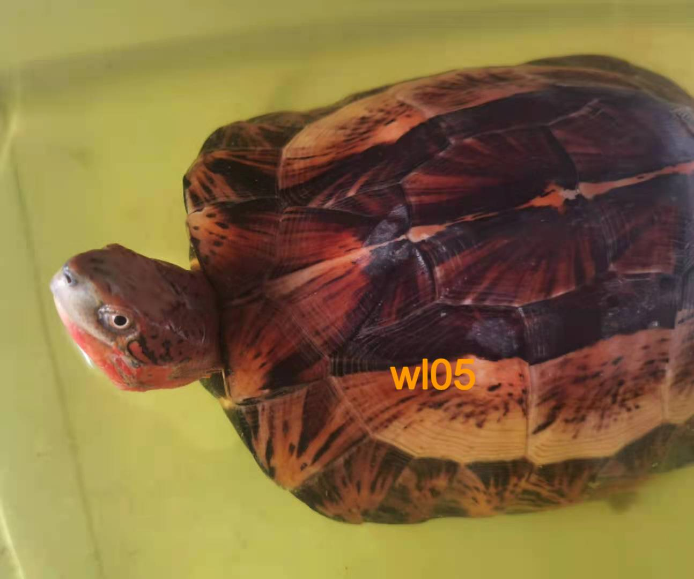

# 黄额闭壳龟的挑选与调理

<page-tags text="发布于：2021-06-08"></page-tags>

>（仅限于黑腹亚种）

先附上一只本人正在调理的黄额

<image-container>
 
</image-container>
<image-description text="（购于2021年6月8号）"/> 

黄额常常被广大龟友叫做“美丽的毒药“，美丽的毒药包含两层意思，美确实是美，为什么是“毒药”？我想更多的包含了
广大龟友对黄额饲养难度的理解，“开食难”，“暴毙“，“十额九壳”广为流传，同时黄额繁殖一直是广大黄额爱好者心中的一道坎。
但是就算如此依然无法阻挡一大批龟友对它的追捧与热爱。本人饲养黄额两年有余，在黄额饲养者中可能算不上太有经验，本篇记录一下
我个人的一些养额经历，如果有不对的地方欢迎指正。

## 挑选

国内境内的黄额已经少之又少，偶尔会有人拿出一些海南或者广西的黄额出售但是产地也无法考证，
可以肯定的是，国内的黄额大部分来源于越南和缅甸，然后通过广西的龟商流入国内。这个过程我们可以大概的想象一下，
龟在这个过程中会受到多少伤害，从被捕获、运输、然后到被销售，最后流入玩家手中。龟在野外的条件下都能生存，为什么到
玩家手里就胆小，不开食、暴毙呢？我想除了环境改变了以外，更大的原因在于龟在这个过程中往往会受到伤害，有些是体外的，但更多的是体内的伤害，
进而产生应激反应。

所以第一步就是要挑选到健康的龟，本人的挑选规则就是：
1. 龟壳完整，没有磕伤
2. 眼睛饱满，眼神有力
3. 四肢有力，不轻易闭壳
4. 其次才是品相了，个人喜好不同，有人喜欢红肉，有人喜欢黄肉，有人喜欢素壳，有人喜欢烟花壳等等，这就看个人品味自行挑选了。

还要补充一点是，购买黄额最好是5、6月份，这样天气温度比较稳定，气温也高，也给我们预留了足够的调理时间。

## 调理

当龟拿到手以后，我们就要开始准备调理了。调理之前准备一个比龟大两倍左右的整理箱或者盒子，
太小了龟无法活动，太大了龟没有安全感。最好是带盖子的整理箱，黄额是越狱高手，加盖可以防止
龟越狱。

阶段一： 补充水分和体力

白天使用多维电解质溶于水，水深高过龟的鼻子，这样就算龟胆小闭壳也可以让它浸在水中，我们可以适当
的加入一些葡萄糖给龟补充一些糖分。

晚上干养。

这样持续两到三天，一是为了使龟补充体力，二也是为了让龟有一个适应。

阶段二：预防可能的病菌感染

预防龟可能的一些病菌感染还是很有必要的，有些感染我们无法通过龟外表观察到，所以这一步我觉得
是很有必要的，我使用的是阿莫西林可溶性粉，用量按照每1L水60mg的用量，同样也是白天泡，晚上干养。
这个过程大概持续一个星期左右。

阶段三： 抗病毒增强免疫

使用黄芪多糖给龟泡水两到三天，方法同上，可做到强免疫和抗病毒作用。在以后的饲养过程中，可以经常使用黄芪多糖
来预防一些常见的疾病。

阶段四：调理肠胃

到了这一步龟应该对我们的环境应该有所适应，下一步就是要为开食做准备了，开食之前我们需要对龟的肠道进行一些调理，
这里可以使用益生菌粉或者妈咪爱溶于水给龟泡水，方法同上。持续时间三天左右。

阶段五： 诱食

到了这一步只要龟本身没有什么大毛病，基本上算是稳定下来了，所以我们可以开始引诱龟吃东西了，
诱食黄额最简单的莫过于使用西红柿，往往百试不爽。这里我会准备好一个成熟西红柿，同时准备好龟粮，
这里我使用的是善玉菌，我会将龟粮泡软，然后捏成小团备用。

下面就可以开食了，将西红柿撕开一个小口，先引诱龟吃，

情况一：

如果龟一开始就吃那就最简单不过了，黄额只要一开口就会追着你吃东西了，
所以开第一口很重要，在龟吃西红柿的过程中，偷偷的将西红柿换成龟粮，这一步很容易，龟吃了两三口龟粮以后，基本上就会自己吃龟粮了。
可能第一次不会成功，可以多尝试几次。

情况二：

如果龟胆小，尝试多次诱食后对你的西红柿依然不闻不问，此时可以使用西红柿汁往龟鼻子里滴，有些龟尝到味道以后就会吃了，如果还是不吃就先给龟关静闭。

最好是干养个两到三天，这样我们再尝试给龟滴西红柿汁，此时龟吸食到的可能性就大大增加，龟尝到味道以后往往就会吃了，后面就同上可以换成龟粮。

情况三：

龟很胆小，见人就缩壳，这种情况我们也不能硬来，只能耐心一点，慢慢等龟适应。龟不伸头，有一个方法，可以将龟放在水比较深的盒子里，龟为了呼吸或者为了逃离这个环境往往会拼命的游泳挣扎，这个时候你就可以在旁边摸摸龟头，或者用你的手臂给它施以援手（最好带个手套黄额指甲穿透力挺强的），让龟慢慢适应你的存在。等龟适应以后就可以继续使用上面的方法进行开食了。

不到万不得已不建议采用撬嘴开食的方法，这样往往会加重龟的应激反应，适得其反。还有可能龟本身就有问题，这种我们也没有办法了。

## 写在最后

不管买回来的龟看起来健康与否，我都会按照上面的方法调理一遍，就算没有病也算是预防调理了。

黄额是一个美丽的物种，在决定饲养前一定要做好充分的准备，不要因为一时冲动去购买饲养，现在饲养黄额也需要相关的合法文件，希望龟类能早日成为大众普及的宠物。

