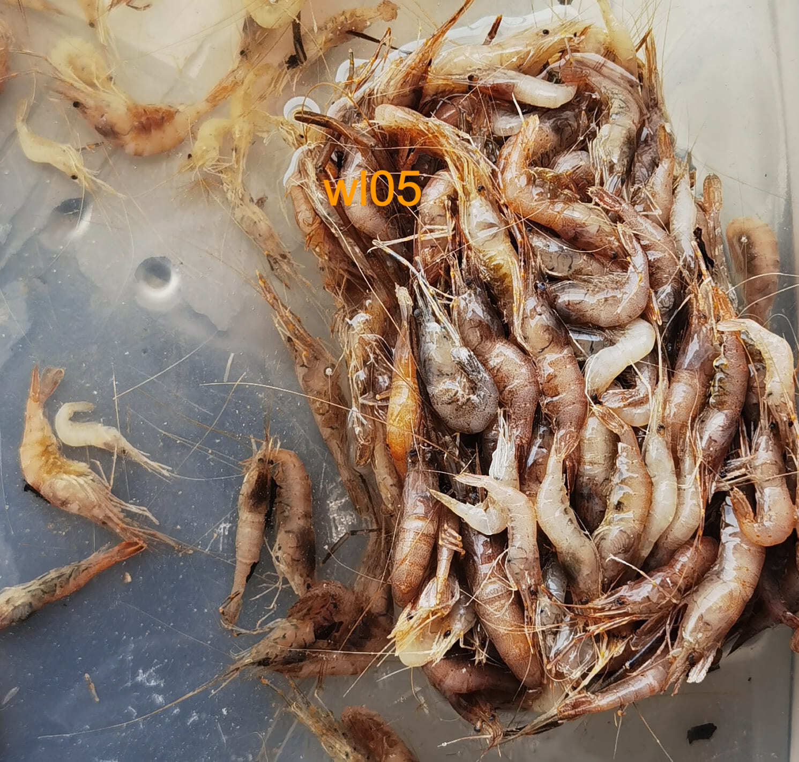
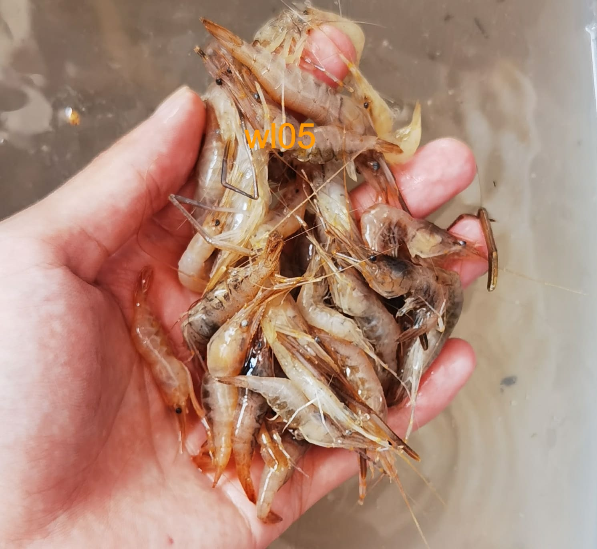
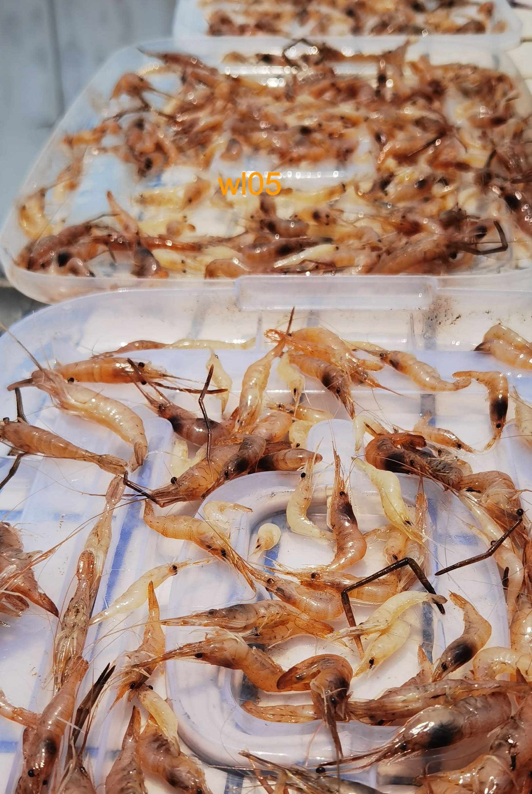
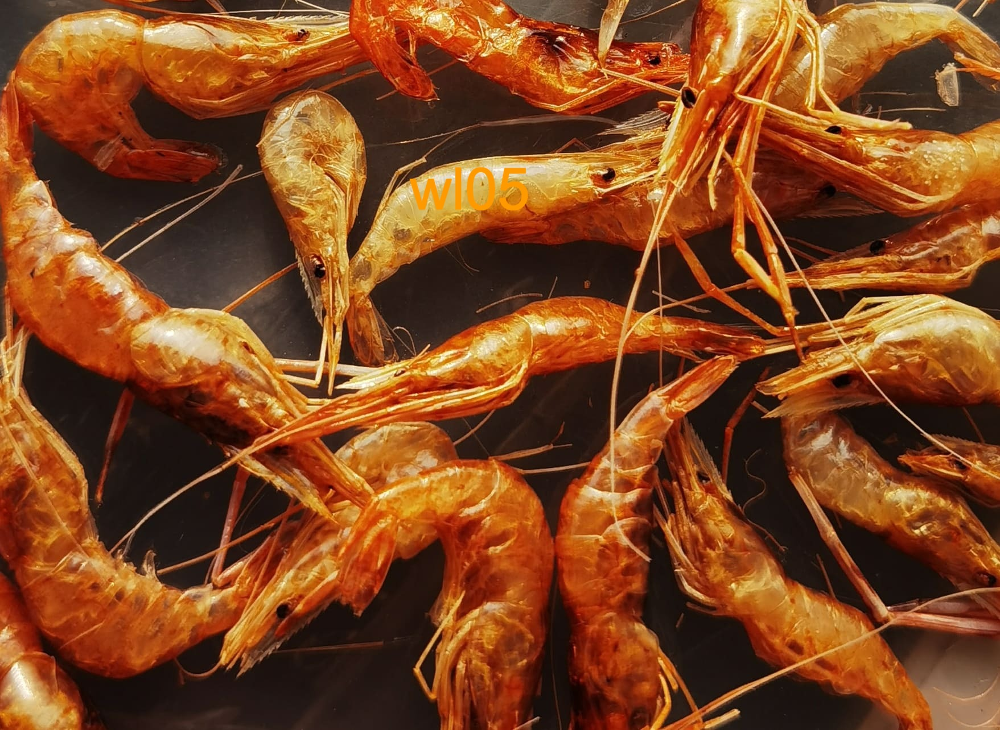
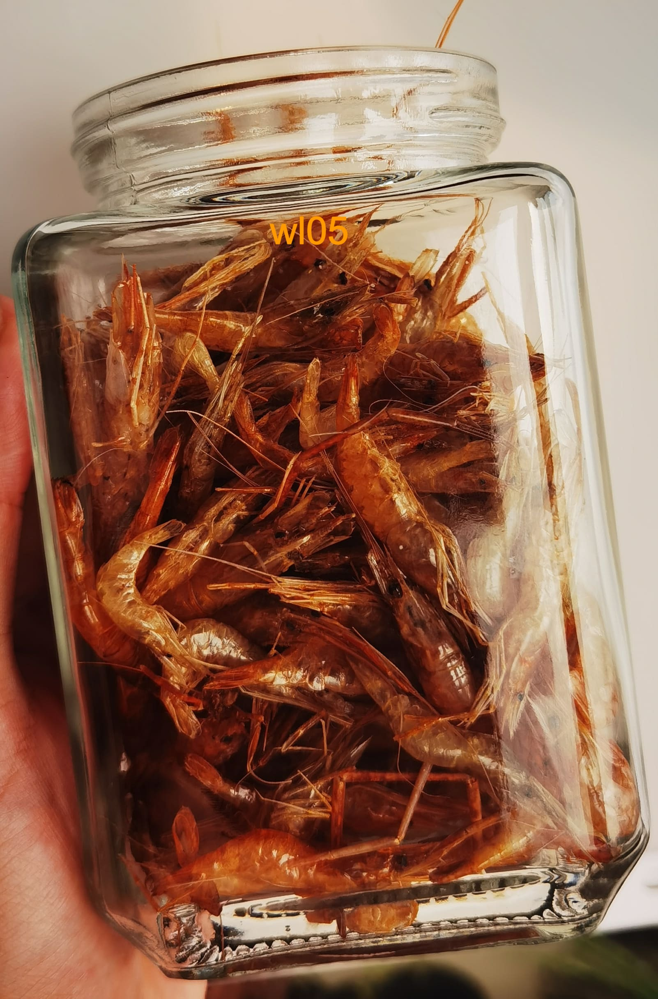
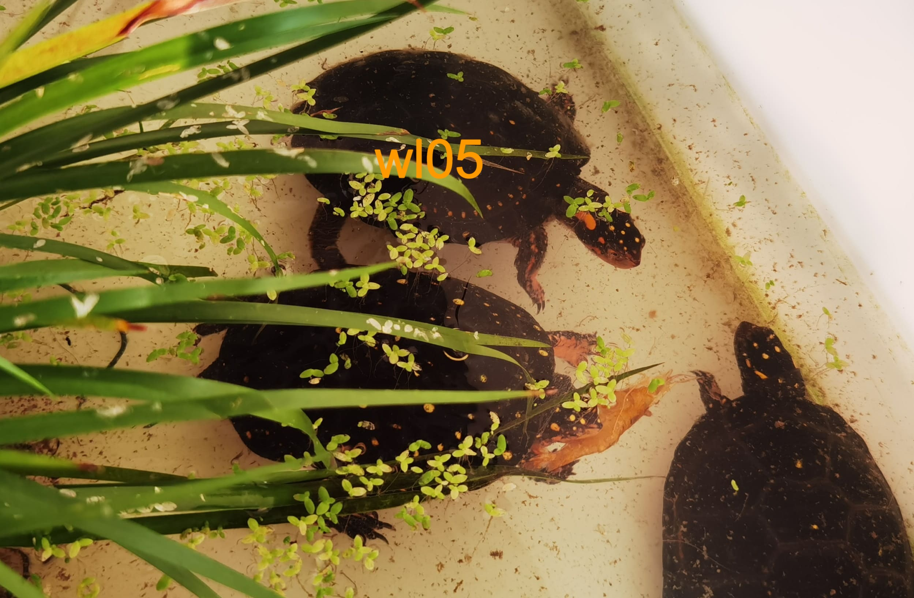
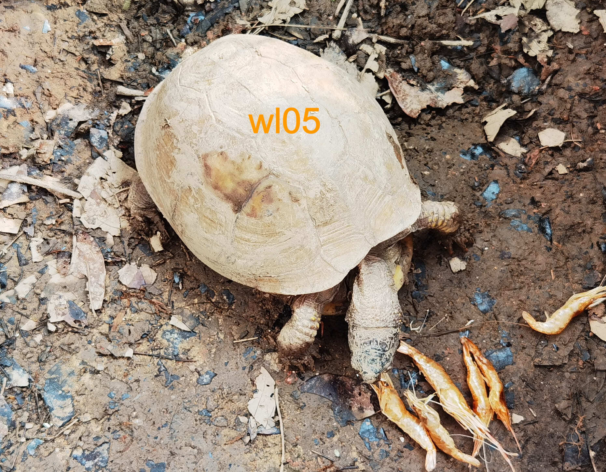
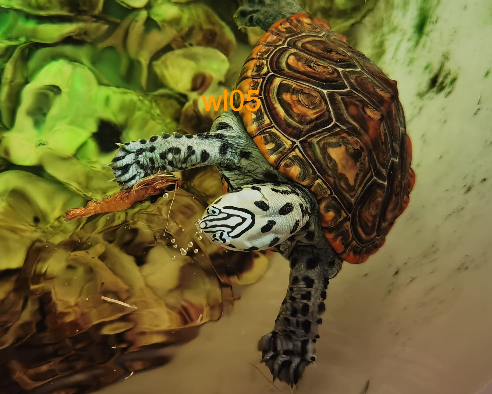

# 虾干的制作

<page-tags text="发布于：2021-07-25"></page-tags>
虾可以补充龟所需要的蛋白质、钙等物质，同时虾里面的虾青素对龟的发色起到至关重要的作用，所以喂虾一直深受广大养龟人的青睐。本人之前一直都是买的虾干，市面上的虾干价钱不贵但是虾的个头都比较小，有比较贵的进口品牌虾干质量确实好，但是如果要长期喂，也是比较费钱（土豪请绕道）。还有一个重要的原因是，很多虾干都是用海虾制作的，含有一定的盐分，如果给龟长期喂龟代谢不了，体内积盐会造成内脏衰竭。于是决定自己买一些淡水活虾晾晒成虾干。当然如果有条件喂活虾也是可以的，但是可能会有寄生虫的风险。如果是喂冻过的虾一定要充分解冻，解冻不充分龟吃了很容易肠炎，一定要谨记。

在某宝搜野生淡水河虾，如果能自己抓那就再好不过了，河虾的个头大多在3-7厘米之间，其实太大也不好，后面晾晒不好晒干，注意这里是**河虾**不是**小龙虾**小龙虾个人感觉不那么干净。可以要求老板发鲜活的，由于天气太炎热老板直接给我急冻加冰袋顺丰了。拿到虾以后，放入冰箱冷冰冻室里面冻了一天，这样可以杀死一部分寄生虫。

<image-container>
 
</image-container>
拿出冰箱准备解冻。
<image-container>
 
</image-container>
加了一点水这样可以更快的解冻。
<image-container>
 
</image-container>
将虾均匀的摆齐，这样可以让每一只虾都被充分晒到，然后将虾置于太阳下暴晒，这样可以蒸发掉河虾体内大量的水分，同时也可以杀死寄生虫。

一面晒2个小时左右，然后需要给虾翻身让另一面也能被充分晒干。

因为虾的个头大小不一，有些大有些小，经过一天的晾晒可能小的已经被晒干了，但是大的还没有被充分晒透，这种情况没有关系，可以将虾干放到通风处待他日太阳好的时候再拿出来继续晾晒。一般连续2-3天即可完全晒干。

<image-container>
 
</image-container>

晒干后的成品，个大肥美，有没有激起食欲😄，闻上去也有一股虾的腥香。

<image-container>
 
</image-container>
最后找一个干燥的盒子，将晾晒好的虾干都装进去，注意防潮，每次喂完记得及时拧紧瓶盖。

试验一下，都追着抢，不错！😄

<image-container>
 
</image-container>
<image-container>
 
</image-container>
<image-container>
 
</image-container>
