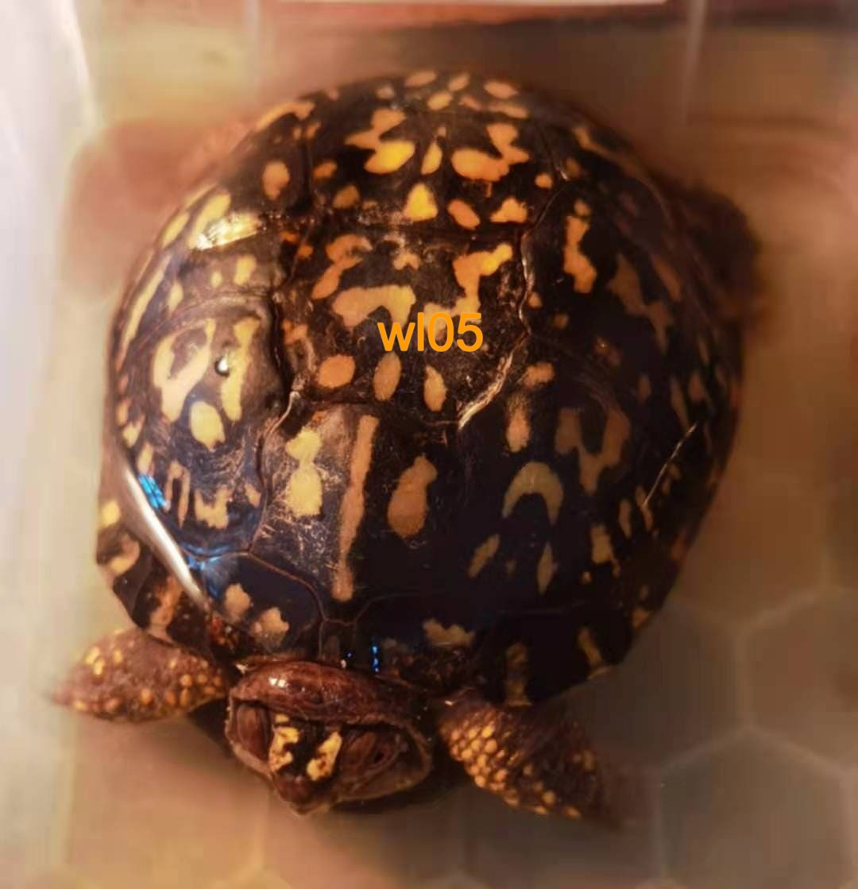
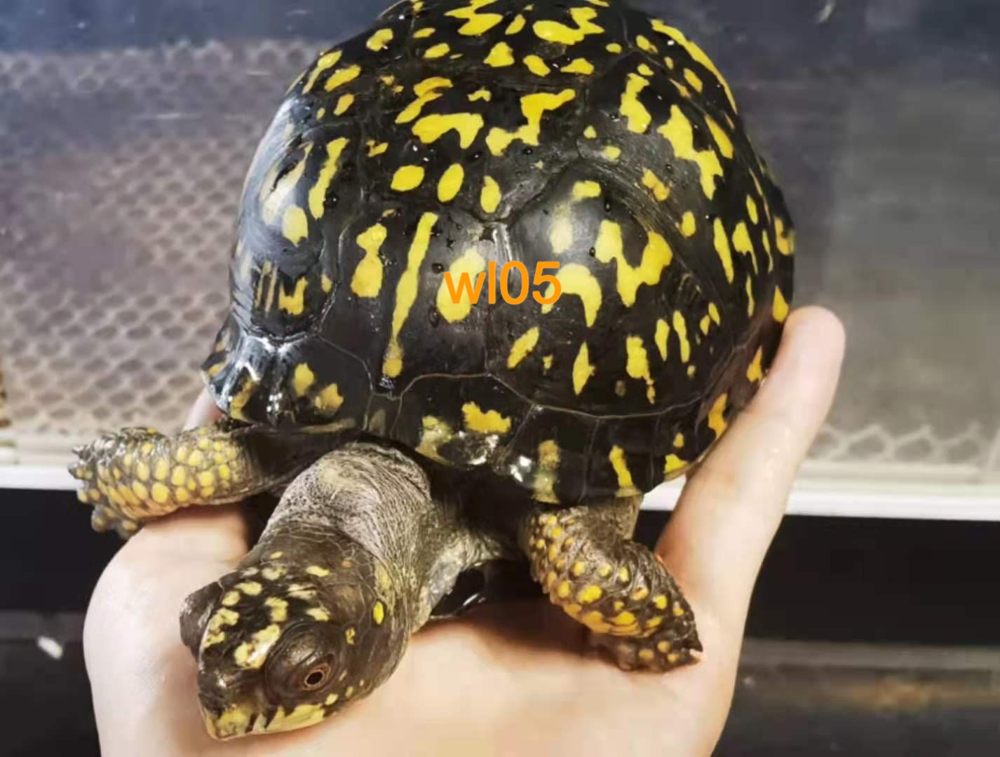
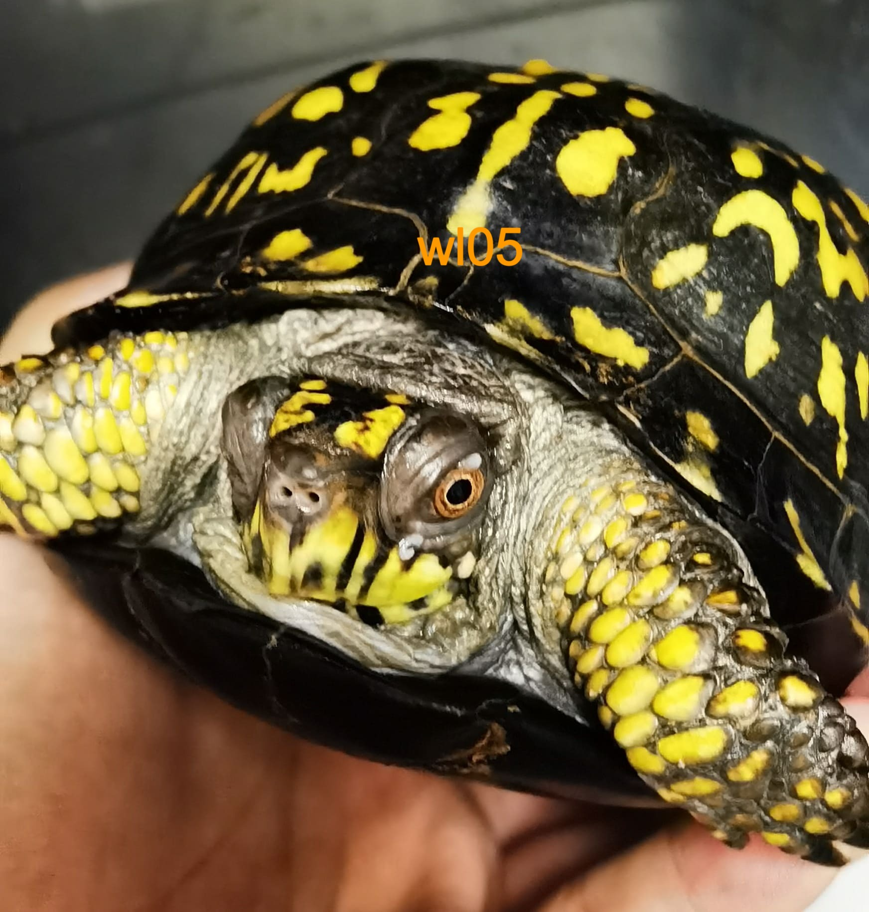
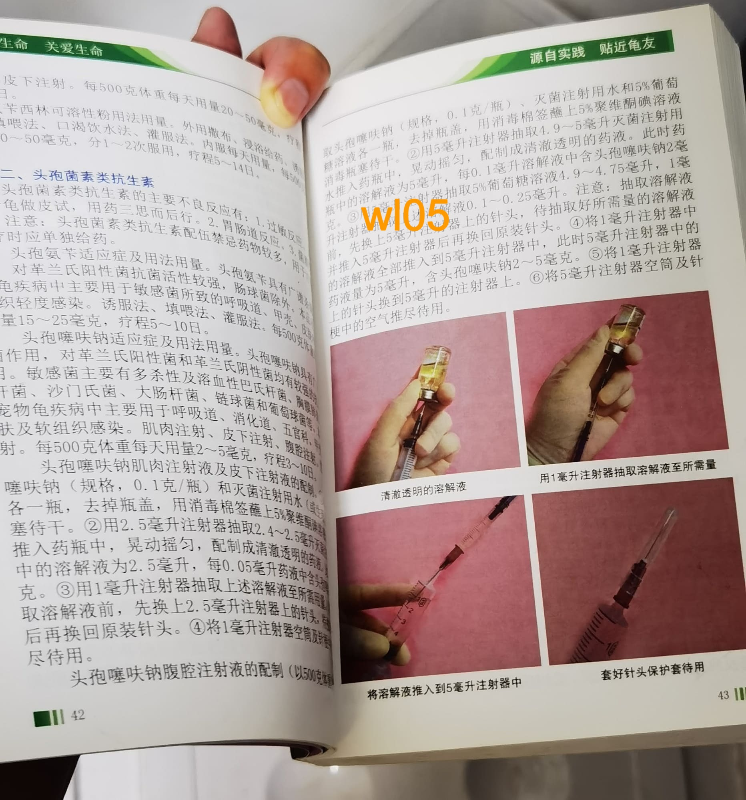
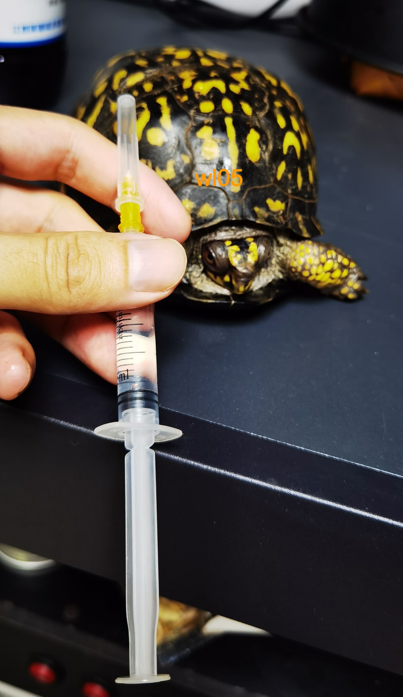
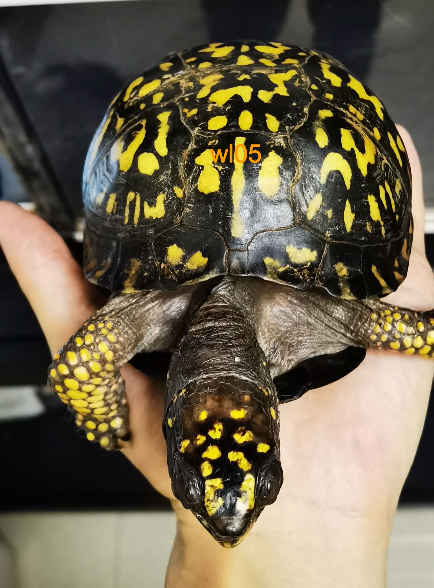

# 东箱摔伤治疗

<page-tags text="发布于：2021-06-23"></page-tags>

<image-container>
 
</image-container>

2021-06-22，由于喂食忘了关好龟箱的门，导致图片这只东箱母龟翻出箱子，箱子离地面大概有一米左右的高度，刚摔时反应剧烈，四肢紧缩闭壳，尾部喷射出大量尿液。捡起全身检查没有发现壳子有损伤，仔细观察发现嘴角有少量血液流出，应该是内部出血了。

自己感觉无比懊恼自责，但是这已经是既成事实，只能想办法治疗。

23日下班回家，买了云南白药粉，本来打算直接拌在饲料里面喂，但是因为摔伤现在龟无比胆小，似乎也失去了食欲，喂食服药行不通，只有采用泡水的方式，在大概0.5L水里泡了大概0.5g的云南白药粉，泡了大概有20分钟左右，龟拉了一些粪便。没有观察到明显的出血情况。后续再泡药观察。

**06-27更新**

<image-container>
 
</image-container>

泡了几天云南白药粉，感觉状态还可以，但是目前还不吃东西，脖子有明显的肿胀。不知道是内脏受伤了还是受到惊吓暂时不吃东西。很焦灼，再调理几天看看情况。

**07-16更新**

经过快两个星期的观察暂时没有发现特别严重的病情反应，但是龟眼角鼻子会有粘液流出，怀疑体内还是有一定的摔伤感染，准备进行消炎抗菌治疗，同时也是考虑给龟补充体力，准备采用腹腔注射葡萄糖。对于眼睛准备采用左氧氟沙星滴眼液进行治疗。

<image-container>
 
</image-container>
<image-description text="眼睛和鼻子都有粘液分泌"/>
<image-container>
 
</image-container>
<image-description text="参考书籍准备使用头孢塞夫纳抗生素进行注射治疗"/>
<image-container>
 
</image-container>
<image-description text="配药准备打针"/>

**07-20更新**

经过了四天的治疗，龟的精神状态好了很多，脖子上的肿胀也消下去了，眼睛也没有流粘液，但是鼻腔还是有粘液流出，呼吸也有呼噜呼噜的声音。估计内部还是有一定的感染。
<image-container>
 
</image-container>
<image-description text="经过了四天的治疗打了五针"/>
再继续治疗观察几天看看情况。

**07-28**

7月20号以后又连续打针三天，每天往眼睛和鼻子里滴左氧氟沙星，中间鼻子还是有粘液直到24号鼻子里面的粘液完全消失。然后开始停药。

然后每天进行诱食，始终拒食。不过状态已经和正常无异，所以心里稍微放心了些。

直到今天早上。像往常一样泡好龟粮，然后将它放入环境中，终于开食了，心中的石头总算落下了，从受伤到今天2021-06-22到 2021-07-28过去了36天。

<video-container>
  <source src="./7.mp4"/>
</video-container>
<image-description text="07月28日"/> 

可能我的治疗方法还是有些问题。因为无法准确的判断出龟到底病在何处，只能根据它从高处摔落但是体表没有受伤、嘴角流过血、鼻子肿胀、鼻子流粘液这些因素综合考量推测龟体内受伤导致体内感染，所以想到通过注射头孢抗生素来广谱杀菌消炎。

龟的恢复期是漫长的，大病过后一定要好好调理，让它渐渐的恢复，从新开始适应，减少它的应激反应。不知道大病过后是否会影响到繁殖。待后续观察。

