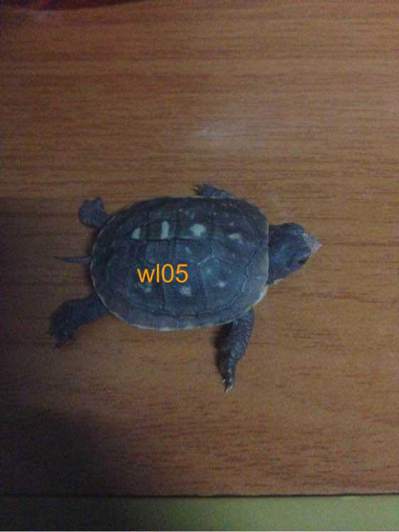
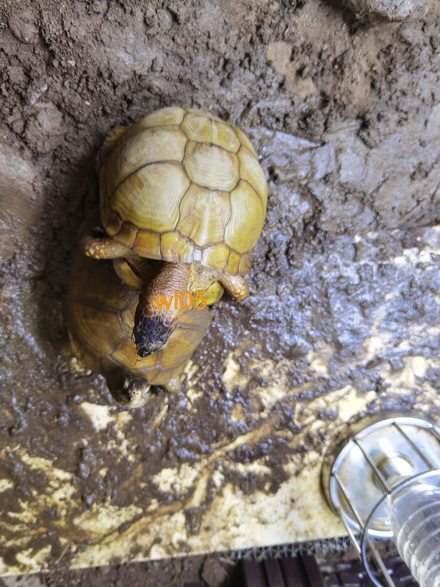
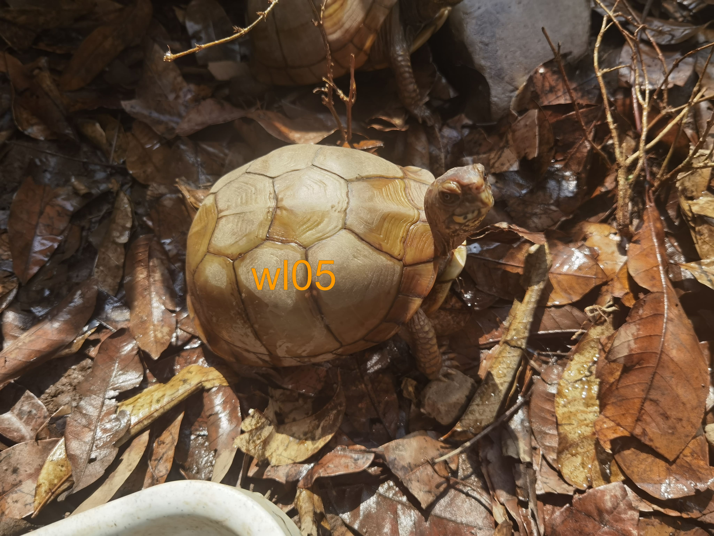
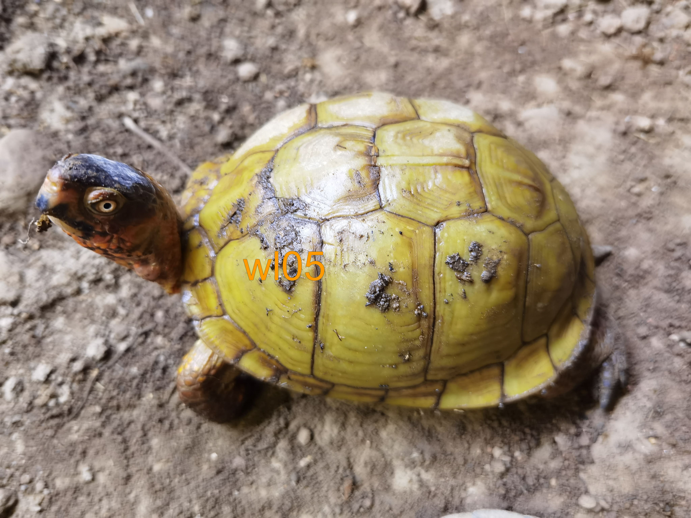
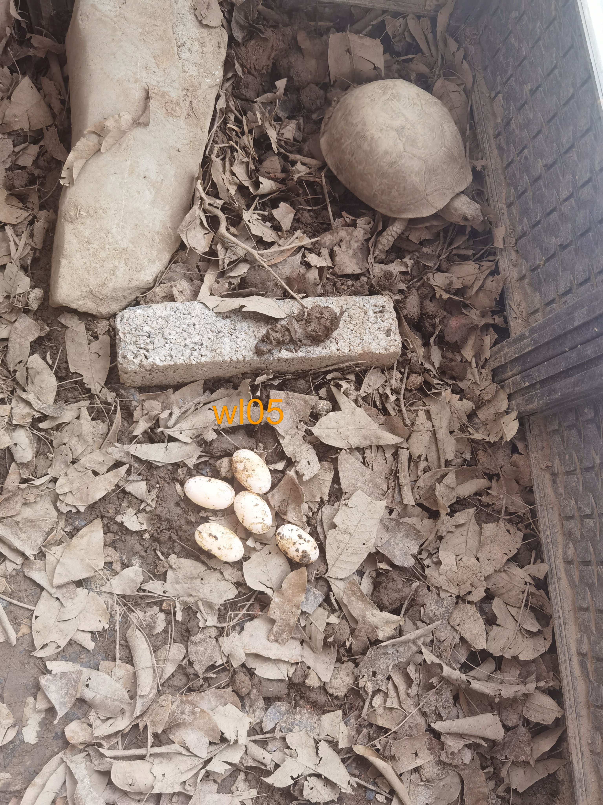
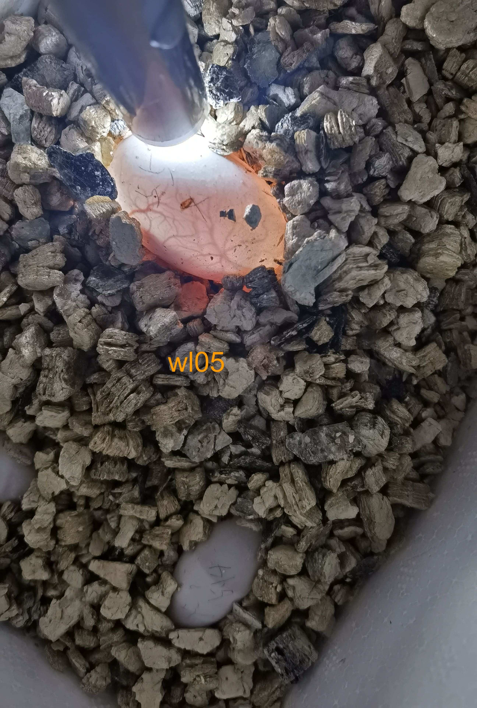
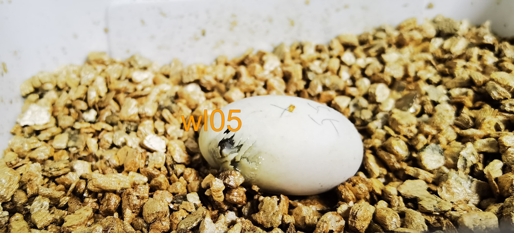
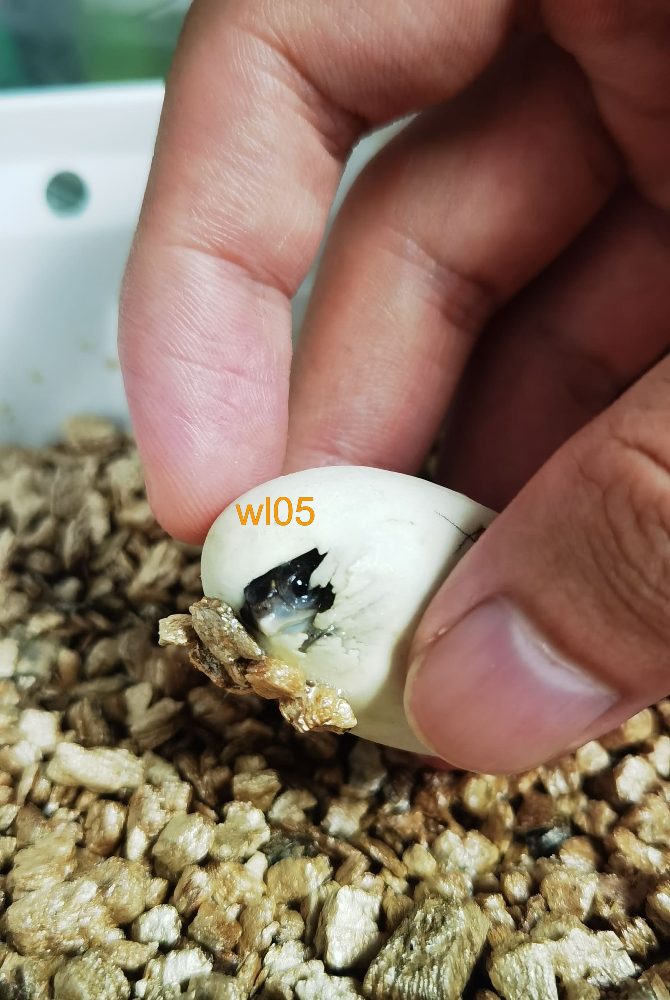
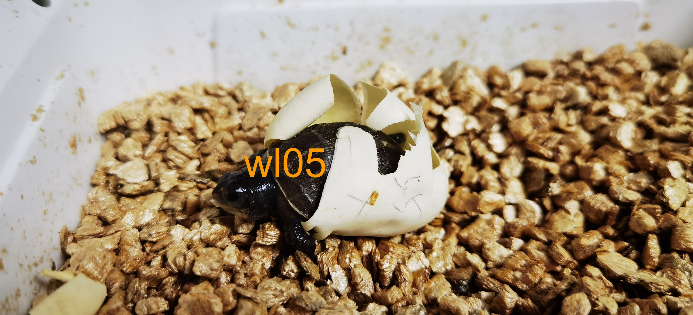
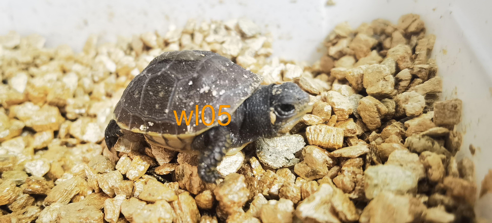

# 三趾箱龟的繁殖

<page-tags text="发布于：2021-07-03"></page-tags>

本来老早就想开始写这篇繁殖记录，最近小龟苗也出壳了，借此也将这第一次的三趾箱龟繁殖经历梳理一下记录下来。

繁殖自己的爱龟应该是每个爱龟人梦寐以求的一个环节。种龟交配、冬眠、第二年产卵、孵化龟蛋、出苗、育苗，每一个过程都充满了趣味性，同时也充满了挑战，但是当最后看到龟苗出壳的一霎那，中间所有经历的曲折与等待都得到了升华，让这一切都充满了美好。见证生命诞生的过程本身就充满了仪式感。

繁殖也算是我的一个情结，一切都要从我的第一只箱龟苗说起，
<image-container>
  
</image-container>
<image-description text="图片拍摄于2015年8月23日"/>
这是我的第一只三趾箱龟苗，转眼间已经过去了将近6年的时间，这只龟也快要到了做妈妈的年纪了。就是从那时起心里就埋下了一个种子，将来我一定要繁殖这个品种。17年的时候收过两对三趾种龟，后来因为工作变动的缘故不得不将其卖掉。辗转又到了20年，心里这个结始终无法解开，于是又开始寻找种龟，最后2020年连收了2公6母，中间龟在饲养过程出现了一些问题最后剩下2公4母😭。2020年捡了四个蛋都没有受精，今年捡了十个蛋只受精了一个，受精率有点感人😭。好在还给我留了一个受精蛋，也算一点安慰吧。

伤心的过程不讲了，接下来就看看这一个受精蛋的历程。

<image-container>
  
</image-container>
<image-description text="这是2020年的时候"/>
种龟开始交配，这是龟爸爸，不过配对的不是龟妈妈，因为没有抓拍到龟妈的交配图片，只好随便拿一张来凑数😂。

<image-container>
  
</image-container>
<image-description text="龟妈写真"/>
龟妈真的就是一个高背圆球，完全的击中了我的所有审美，真的是爱不释手。时不时我也会拿起来把玩一番，哈哈哈。
<image-container>
  
</image-container>
<image-description text="龟爸的特写"/>
这是公龟壳色非常好，犹如黄玉一般，龟的头部也是淡红色的，也可以说完全长在我的审美上。对于这样的组合我真的充满了期待，真想看看它们一起生出的小龟苗会是什么样的。

经过漫长的等待，到了今年5月份，这一天是5月5号，前面几天我已经摸到龟妈腹种有蛋了，我知道它会在这几天产蛋，所以也特别关注，龟妈在产蛋前半个月左右食量会变大，等到腹中能摸到蛋以后体重也会增加，产蛋前几天它会到处爬以寻找合适的产蛋地点。因为我布置环境有一些问题，就是龟箱里的土层有浅有厚，导致很多次母龟都会找错位置在土层浅的地方抛坑，然后我给它挪动位置，因为位置发生了变化，龟妈停止了下蛋，这个过程折腾好几次，最后我将母龟封闭在某个区域最后开始产蛋了。后面针对这一点我也将环境做了改进，将土浅的区域用瓷砖铺了一层，这样母龟就只能选择去土厚的区域产蛋了。

<video-container>
  <source src="./5.mp4"/>
</video-container>
<image-description text="龟妈下完蛋了"/>
母龟下蛋的过程还是挺漫长的，一般会持续一个小时左右，这个过程就尽量不去打扰它了。
<image-container>
  
</image-container>
<image-description text="收获"/>
最后收获了五枚龟蛋，算是不错的收获了。但是最后只有一枚蛋受精😭。龟蛋一般会在一天后出现精斑。

<image-container>
  
</image-container>
<image-description text="龟蛋的发育，2020年6月7日"/>
经过一个月的发育，用手电筒打光可以明显的看到蛋在发育，蛋内遍布血丝。
<image-container>
  
</image-container>
<image-description text="6月28日"/>
<video-container>
  <source src="./9.mp4"/>
</video-container>
<image-description text="6月28日"/>
<image-container>
  
</image-container>
<image-description text="6月28日"/>
经过50多天的等待，小龟终于开始破壳了。
<image-container>
  
</image-container>
<image-description text="6月30日"/>
破壳经历了两天的时间，这期间小龟没有完全吸收的蛋黄也会慢慢吸收。
<video-container>
  <source src="./12.mp4"/>
</video-container>
<image-description text="7月2日"/>
<image-container>
可惜有点小卷尾，应该是孵化环节哪里出了问题，只有在以后慢慢总结孵化经验了。
  
</image-container>
<image-description text="7月2日"/>
肚脐还没有完全收好，不过每天都越来越小了。小家伙萌得不行😄。

**写在最后：** 虽然今年不是丰收的一年，但是也算是积累了一些经验，玩繁殖本身就是一个长期的过程，需要时间的沉淀，相信明年会越来越好。
