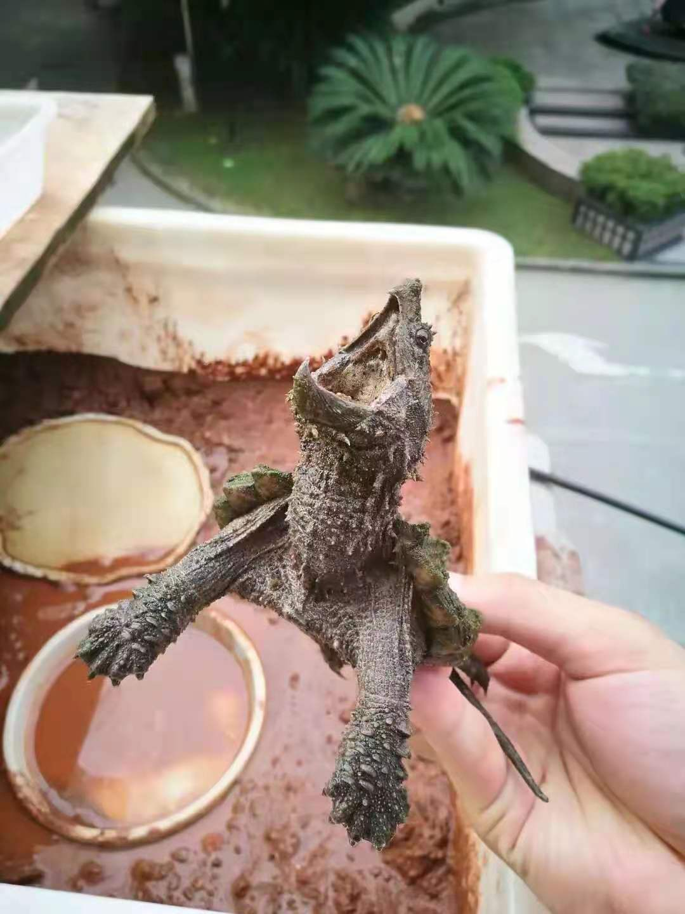

# 龟途

今天是2021年6月1日，忽然想写写这些年的养龟历程。语言表述能力有限，全当自话自说。

乌龟应该算是比较小众的宠物了，比起猫狗，养龟的人相对来说还是很少的。

为什么我会喜欢乌龟？我对龟喜爱的萌芽缘自小时候的一次经历。

大概在我6到8岁的时候（具体时间实在想不起来了），大姨父下田干农活回家路上沿着河边往家走，忽然发现河岸边趴着一只核桃大小的小家伙，
一只小甲鱼苗（俗称小王八），就这样这个小家伙被大姨父带回了家，第二天我去大姨父家玩，这小家伙被我一眼看中（实际上是我拿着就不撒手），
就这样这个小家伙被我带回了家。回家路上别提有多高兴。因为这小玩意儿咬人，脖子能伸很长，就算抓它屁股不留神也会被咬，小时候胆子小怕得不行，于是一路上不停换手，结果快到家了，就在换手之际，这小家伙忽然就挣脱了我的束缚，掉在了路上。离奇的事情发生了，我赶紧弯腰去找，但怎么也没找到（周围都是空地没有遮挡物）。当时别提有多懊恼，但是也实在没想明白为什么平白无故就消失得无影无踪了。就是这次经历在我心里深深地埋下了种子，对那只小王八一直魂牵梦绕。

从那以后心中一直对乌龟念念不忘，经常做梦也要捡到乌龟。

随着时间的流逝，家里经济情况逐渐变好，添加了家彩色电视，通过电视新世界的大门为我敞开了。

不知道大家有没有看过《老少爷们打鬼子》这部喜剧电影，电影里面的日本军官养了一堆乌龟。这是我第一次认识到原来乌龟还有
这么多种类，里面乌龟高高圆圆的背再一次深深的吸引了我。

<image-container>
  
</image-container>

看过这部电影以后，对乌龟的喜爱越发加深，那个时候的我是多么渴望拥有一只高高圆圆的乌龟啊。

时间一转眼就到了我上初中的时候，我们小县城的花鸟市场开了起来，
有鱼有花，最重要的是有乌龟卖，品种只有一种，发财龟（红耳巴西龟，后来变成了入侵物种），虽然和我心目中高高圆圆的乌龟相去甚远，但是没得选，就算如此也是喜欢得不得了，10块钱一只，存了两个星期的零花钱买了一只。

诚然是巴西这种完全没有难度的品种，前前后后也养死了好几个，因为完全没有饲养经验也没有任何人指导。

时间再一晃到了大学，视野逐渐打开，13年开始接触贴吧，逐渐加了一些龟友群，淘宝上也能买到乌龟。我了解到原来乌龟的品种有200多种，有一些品种还有不同的亚种，乌龟很多不是高高圆圆，不同种类的龟饲养方式可能千差万别。还记得第一只网购的是一只大鳄龟，当时是因为看了动物世界播放的大鳄龟钓鱼的视频，被那霸气的身型和有趣的捕鱼方式所吸引。就是下面这只，

<image-container>
  
</image-container>

此龟养了两年，在16年开春出眠不久死了。

到这里算是为后面的养龟之路打开了大门。

本人也没有其他的爱好，唯独对龟深深着迷，我想以后的日子也不会少了龟的陪伴，养龟养了这么些年，我深知养好龟并不容易，我们常开玩笑说，“养好了送你走”，但是没有饲养经验的话，龟还是非常脆弱的，建议大家在养之前一定要查阅相关资料，做好充分的准备，珍爱生命！

