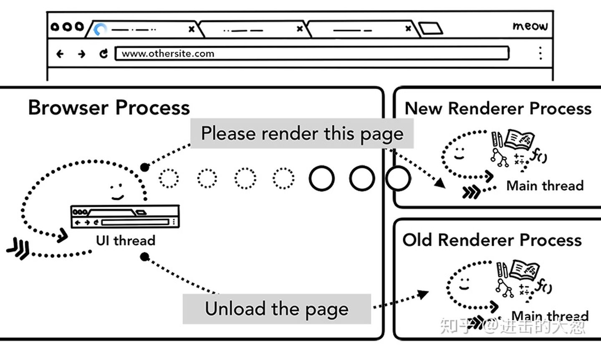

# 浏览器篇（二）- 页面导航过程发生了什么

<span style="font-size:14px;text-decoration:underline">发布于：2021-06-26</span>

老生常谈的问题浏览器地址栏输入URL回车到页面渲染出来这个过程中发生了什么？结合上一篇浏览器架构的知识，我们来一探究竟。
## 页面控制

在上一篇中我们介绍了Chrome浏览器是多进程架构，进程之间分工协作。打开浏览器，除了Tab里面的内容，我们眼睛能看到的部分都是由浏览器进程来控制的。浏览器进程里面又有分工协作的线程，比如负责操作界面的UI线程（绘制操作按钮，地址导航栏），负责网络请求的网络线程，负责文件访问控制的存储线程。


<center style="font-size:14px;text-decoration:underline">浏览器进程包含 UI线程,网络线程和存储线程</center> 


当我们在地址栏输入URL，浏览器进程的UI线程会负责处理。

## 过程分析

### 步骤1. 处理输入

因为Chrome的地址栏既可以作为查询入口又可以作为网址输入框，所以在这里UI线程会负责判断输入的字符串到底是查询字符串还是网站URL。


<center style="font-size:14px;text-decoration:underline">UI线程询问输入是查询字符串还是URL</center> 

### 步骤2. 开始导航

当我们敲下回车，UI线程会告诉网络线程获取网站内容，此时标签的左上角开始转圈圈，网络线程此时会进行DNS解析、建立TLS连接。


<center style="font-size:14px;text-decoration:underline">UI线程告诉网络线程导航到mysite.com</center> 
如果这里是重定向请求比如301，网络线程会告诉UI线程服务器要求重定向，然后开始另一个URL跳转。

### 步骤3. 读取响应

一旦收到响应网络线程会根据response header里面的Content-Type来判断响应数据(payload)的类型，但是因为Content-Type有可能会缺失或者跟数据的实际类型不一致，这里会进行 [MIME Type sniffing](https://developer.mozilla.org/en-US/docs/Web/HTTP/Basics_of_HTTP/MIME_types)。这个过程是非常复杂的，源代码里面的注释也说了```Detecting mime types is a tricky business```，如果想了解不同浏览器是如何处理content-type/payload的，可以参考[源代码](https://cs.chromium.org/chromium/src/net/base/mime_sniffer.cc?sq=package:chromium&dr=CS&l=5)里面的注释。


<center style="font-size:14px;text-decoration:underline">响应头包含Content-Type，payload的实际数据</center> 

如果返回的是HTML文档，则会交给渲染进程来处理；如果是文件比如PDF则表明是下载请求会交给下载管理器进行下载。


<center style="font-size:14px;text-decoration:underline">网络线程询问响应数据是否是来自安全站点的html</center> 

这里会同时进行SafeBrowsing检测，如果站点的域名和响应数据匹配到已有的恶意站点，网络线程会抛出一个警告页面。此外还会进行[ Cross Origin Read Blocking (CORB)](https://www.chromium.org/Home/chromium-security/corb-for-developers) 检查，保证敏感的跨站点数据不会进入到渲染器进程。


### 步骤4. 分配渲染进程

当上面的检查都做完后，网络线程就通知UI线程一切准备就绪，然后UI线程找到一个渲染进程进行页面的渲染。


<center style="font-size:14px;text-decoration:underline">网络线程告诉UI线程去找到一个渲染进程</center> 

由于网络请求获取响应会花一些时间，所以在这个过程中会做一些优化。在步骤二中UI线程告诉网络线程发送请求时，UI线程是知道将要渲染一个网站的，所以在网络请求的过程中UI线程会并行的寻找和启动一个渲染进程。当请求如期返回时，此时渲染进程已经准备好了，就可以进行后面的渲染任务，以此节省时间。

### 步骤5. 提交导航

现在数据已经返回，渲染进程也准备好了，此时IPC会从浏览器进程发送到渲染进程以此来提交本次导航，同时会将HTML 数据传递给渲染进程。一旦浏览器进程收到来自渲染进程的提交确认回应，此次导航就完成了，后面就进入文档的加载阶段。

到了这个时候，导航栏会被更新，安全指示符（security indicator）和站点设置UI（site settings UI）会展示新页面相关的站点信息。当前tab的会话历史（session history）也会被更新，这样当你点击浏览器的前进和后退按钮也可以导航到刚刚导航完的页面。为了方便你在关闭了tab或窗口（window）的时候还可以恢复当前tab和会话（session）内容，当前的会话历史会被保存在磁盘上面。


<center style="font-size:14px;text-decoration:underline">浏览器进程与渲染进程之间的IPC，请求渲染页面</center> 

### 额外步骤： 初始加载完成

一旦导航提交了，渲染进程就开始加载资源渲染页面了。后续的篇章我们详细的介绍这个过程，一旦渲染进程完成渲染它会发送IPC给浏览器进程（注意这发生在页面上所有帧（frames）的onload事件都已经被触发了而且对应的处理函数已经执行完成了的时候），此时UI线程会停止tab左上角的loading 圈圈。


<center style="font-size:14px;text-decoration:underline">渲染进程到浏览器进程IPC通知页面加载完了</center> 

## 导航到不同的站点

现在一次普通的导航就完成了。但是如果现在再次在地址栏输入一个新的网址会发生什么呢？其实整体的过程和上面的步骤差不多，但是还是会有一些区别，在导航到其他页面的时候需要检查当前页面是否有监听**beforeunload**事件。


**beforeunload**事件就是在你要离开或者关闭页面的时候弹出一个警告框，询问你是否确定离开当前页面。在tab里面的内容都是由渲染进程控制的当然也包括js代码，所以导航到新站点之前浏览器进程必须要询问渲染进程是否有监听**beforeunload**事件。


> 注意：不要随意添加 beforeunload 事件监听。它会产生延迟，因为需要在导航开始之前执行beforeunload的事件回调。在真正需要的时候才监听这个事件，比如需要警告用户在输入表单还没有提交准备离开页面时提醒用户输入数据将会丢失。 


<center style="font-size:14px;text-decoration:underline">浏览器进程到渲染进程IPC告诉渲染进程将导航到一个新的站点</center> 


如果是在渲染进程中跳转到其他页面，例如点击网站链接或者window.location 到新的网址，渲染进程首先会检查是否有监听beforeunload 事件。后续的步骤也跟前面一样。不同的是导航请求是从渲染进程开始然后到浏览器进程。


当导航到新站点，会有单独的渲染进程来处理这次导航，同时会保留当前渲染进程以便处理unload等事件。想了解更多可以参考[an overview of page lifecycle states](https://developers.google.com/web/updates/2018/07/page-lifecycle-api#overview_of_page_lifecycle_states_and_events)以及如何使用[the Page Lifecycle API.](https://developers.google.com/web/updates/2018/07/page-lifecycle-api#overview_of_page_lifecycle_states_and_events)接入事件。


<center style="font-size:14px;text-decoration:underline">浏览器进程到新渲染进程IPC告诉新渲染进程渲染页面，同时告诉老的渲染事件处理unload事件</center> 


## Service Worker存在的场景

Service Worker可以代理我们的网络请求将响应缓存或者请求新的数据。如果设置service worker从缓存中拿数据就不会发起网络请求。

需要特别记住的点，service worker也是运行在渲染进程中的。那么问题来了，当有新的导航请求时，浏览器进程如何判断新站点是否注册了service worker。


当注册一个service worker后，service worker的scope将作为引用保存下来。想了解更多关于scope的信息可以阅读这篇文章[The Service Worker Lifecycle](https://developers.google.com/web/fundamentals/primers/service-workers/lifecycle)。 当导航开始时，网络线程就会参照已经注册了的service worker scopes来检查域名，如果这个网站注册过service worker，UI 线程就会找一个渲染进程来执行service worker代码。

<center style="font-size:14px;text-decoration:underline">浏览器进程中网络线程查找service worker scope</center> 

service worker决定是使用本地缓存数据还是请求最新的数据。


<center style="font-size:14px;text-decoration:underline">浏览器进程中UI线程启动一个渲染进程，随后渲染进程中的worker线程发起网络请求</center> 


## 导航预加载 ( Navigation Preload)

如果 Service Worker 最终决定从网络中请求数据，浏览器进程和渲染进程之间的这种往返可能会导致延迟。 Navigation Preload 是一种通过在 Service Worker 启动的同时加载资源来加速此过程的机制。它会在header中标记这些请求，让服务器决定如何为这些请求返回数据；比如只是更新数据而不是整个文档。


<center style="font-size:14px;text-decoration:underline">浏览器进程中UI线程并发的启动一个渲染进程处理service worker同时触发网络请求</center> 

## 参考资料

[Inside look at modern web browser (part 2)](https://developers.google.com/web/updates/2018/09/inside-browser-part2)