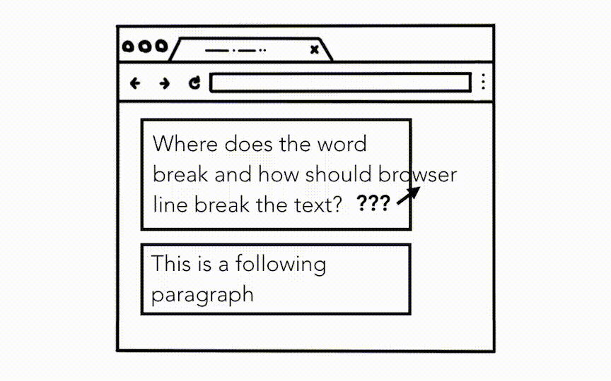
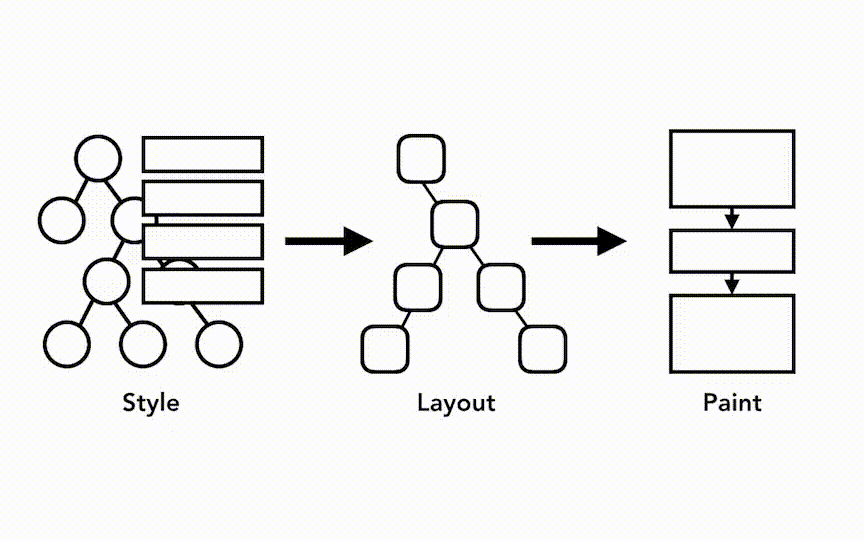
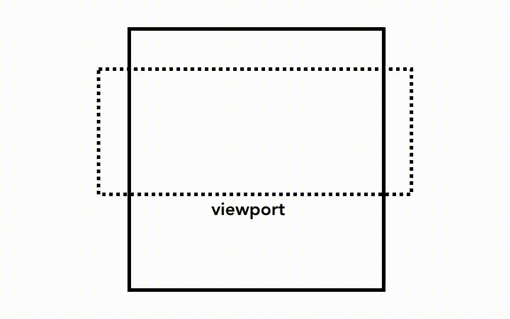
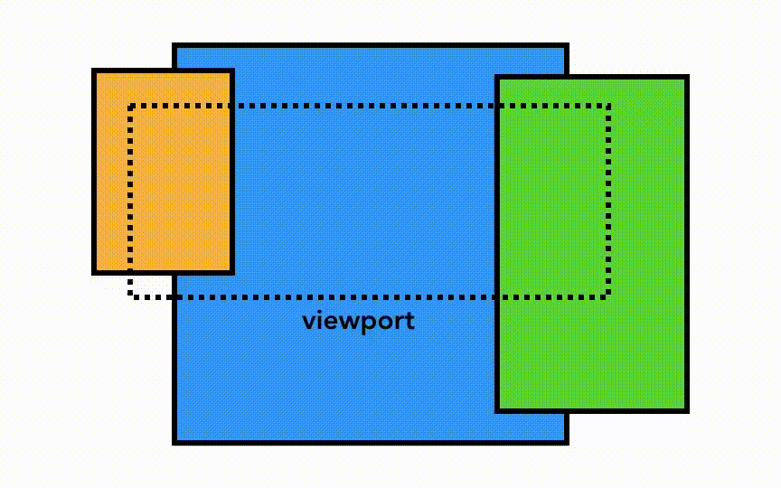

# 浏览器篇（三）- 渲染进程的内部工作过程

<page-tags text="发布于：2021-06-30"></page-tags>

在上一篇中我们遗留了一个问题，渲染进程是如何加载文档的？HTML，CSS，JS是如何被解析的? 本篇我们就来一探究竟。

## 前言

渲染进程涉及到网页性能的很多方面，可想而知这里面一定有不少的东西，本篇只是一个总体上的概述，如果你非常感兴趣想研究一下，可以参考[the Performance section of Web Fundamentals](https://developers.google.com/web/fundamentals/performance/why-performance-matters)

## 渲染进程处理网页内容

在前面的篇章中我们也提到过，tab里面的所有内容都是由渲染进程来控制的。在渲染进程中主线程会处理你的大部分代码。如果你使用```web worker``` 或者```service worker```，wokrder线程会处理你的部分代码。合成（Compositor）和光栅 （raster）线程也在渲染器进程内运行，以高效流畅地渲染页面。


总之一点，渲染进程的核心任务就是将HTML、CSS、JS转换为用户可交互的网页。


<image-description text="渲染进程里面有一个主线程，多个worker线程，一个合成（Compositor）线程和一个光栅 （raster）线程"/>


## 网页解析过程

### DOM的构建

当渲染进程收到来自浏览器进程的导航提交信息并且开始接收HTML数据，主线程就开始将HTML 文本字符串解析为DOM（Document Object Model)。

DOM是网页在浏览器中的内部表示，同时也是我们通过js与网页交互的数据结构和API。

[HTML Standard](https://html.spec.whatwg.org/)定义了如何将HTML 文档解析为DOM。你可能也注意到了浏览器解析HTML从来不会报错。比如我们忘了给<span>标签加上闭合标签</span>这里也不会报错。再比如这一串 ```Hi! <b>I'm <i>Chrome</b>!</i>```也可以被正常解析，貌似跟正常的写法```Hi! <b>I'm <i>Chrome</i></b><i>!</i>```没有什么区别。要问为什么的话，那就是设计如此，HTML就是这样设计的，它可以帮我们处理这些错误。如果想了解更多可以参考["An introduction to error handling and strange cases in the parser"](https://html.spec.whatwg.org/multipage/parsing.html#an-introduction-to-error-handling-and-strange-cases-in-the-parser)

### 子资源加载

在HTML文档中通常会用到外部资源，比如images,CSS,JS。这些资源要么从网络中获取要么从缓存中获取。主线程可以在解析DOM的过程中找到这些标签并且请求这些资源，但是为了提升效率，浏览器会同时启动一个预加载扫描器（preload scanner），预加载扫描器会查看有HTML解析器生成的tokens，看看里面有没有，<link>之类的标签，有的话就把请求发送给浏览器进程的网络线程。


<image-description text="主线程解析HTML并构建DOM树"/>

### JavaScript会阻塞解析过程

如果在解析HTML的过程中遇到```<script>```标签，HTML的解析会被阻塞，然后加载、解析并执行js代码。为什么？ 因为js的执行可能会改变文档的结构(HTML的解析模型[overview of the parsing model](https://html.spec.whatwg.org/multipage/parsing.html#overview-of-the-parsing-model))。这就是为什么HTML解析器必须要等到js执行完了才能重新开始解析文档。如果你对js的执行过程感兴趣可以参考[JavaScript engine fundamentals: Shapes and Inline Caches](https://mathiasbynens.be/notes/shapes-ics)


### 告诉浏览器你想如何加载资源

有很多方法可以告诉浏览器如何加载资源。比如你可以通过给```<script>```标签加上```async```或者```defer```属性，这样浏览器会异步的加载js代码，不会阻塞HTML的解析。如果合适你也可以使用[JavaScript module](https://developers.google.com/web/fundamentals/primers/modules)。另外通过```<link rel="preload">``` 标签可以告诉浏览器当前资源是必须的并且希望尽快下载。想了解更多可以参考[ Resource Prioritization – Getting the Browser to Help You.](https://developers.google.com/web/fundamentals/performance/resource-prioritization)


### 样式计算
光有DOM还不够，我们还需要样式才能更好的展示我们的页面。主线程会解析CSS并且决定每个DOM节点的计算样式（computed style）。计算样式是基于CSS选择器的信息，这个信息表示每个元素应用什么样式。在开发者工具的```computed```部分可以看到这些信息。


<image-description text="主线程解析Css，并给Dom节点加上计算样式"/>

就算我们不写任何CSS代码，每个DOM节点也都会有一个计算样式。比如```<h1>```标签比```h2```标签大、给每个元素定义margin。这是因为浏览器有一个默认的样式表。Chrome的默认样式表可以参考[you can see the source code here](https://cs.chromium.org/chromium/src/third_party/blink/renderer/core/html/resources/html.css)


### 布局 (Layout)

现在渲染进程知道了文档的结构和Dom节点的样式，但是要渲染页面这些还不够。打个比方，我们玩一个猜图游戏，你通过手机向你的朋有描绘一幅图，你说这儿有个大的红圈圈，这有一个小的正方形。你朋友肯定懵一脸。因为你的朋友不知道大圈圈和正方形在画面中的位置。


<image-description text="向你的朋友描绘一副画面"/>

布局是计算元素几何结构的过程。主线程遍历DOM树和计算样式来创建布局树，布局树包含 x y 坐标和边界框大小（bounding box sizes）等信息，布局树一般来说比Dom 树要小，它只包含跟页面可见内容相关的信息。比如设置元素```display: none```这个元素就不会包含在布局树中（注意:```visibility: hidden```是会包含在布局树中的，只是对我们肉眼不可见）。还有就是伪元素，比如```p::before{content:"Hi!"}```，虽然伪元素没有包含在DOM中但是会包含在布局树中。


<image-description text="主线程遍历带有计算样式的DOM树然后产出布局树"/>

布局过程不是那么简单和容易的。即使是最简单的页面布局，比如从上到下的排列段落，这个过程就必须要考虑到字体的大小以及每一行到哪里换行，因为这些会影响到段落的大小和形状，更进一步会影响到下一个段落的位置。


<image-description text="由于换行导致布局改变"/>

我们可以通过CSS干很多事情，比如使元素浮动，隐藏溢出的部分或者改变输入框的输入方向。因此我们d可以想象布局阶段有多么复杂，在Chrome团队中有一个专门的团队来负责布局过程。如果你对他们的工作感兴趣可以看下这个视频[few talks from BlinkOn Conference](https://www.youtube.com/watch?v=Y5Xa4H2wtVA)


### 绘制过程（Paint）


现在我们已经有了DOM，样式和布局，但是要渲染页面这些还是不够。就跟画画一样，知道了画中元素的大小，形状和位置，你还要考虑从哪个元素开始画起。


<image-description text="一个人站在画布面前思考是应该先画圆还是应该画正方形"/>

举个例子，给某些元素设置了不同的z-index属性，在这种情况还按照元素在HTML中的顺序渲染，渲染出来的页面就会有问题。


<image-description text="页面元素按HTML中的顺序出现，因为没有把z-index考虑进去导致渲染出来的页面不正确"/>


在绘制这一步，主线程遍历布局树来创建绘制记录。绘制记录是绘制过程的笔记，就像“应该先画背景再画文字再画长方形”。如果你使用过canvas，那么你对这个过程应该不会感到陌生。


<image-description text="主线程遍历布局树产生绘制记录"/>

### 更新渲染流水线成本高昂

需要着重理解的一点，在这个渲染流水线中，每一步产生的数据都是以上一步生成的数据为基础的，比如布局树发生了变化就需要为受到影响的部分重新生成绘制顺序。


<image-description text="DOM+Style、Layout 和 Paint 树，按顺序生成"/>

如果你使用动画，那么这个流水线就必须要在帧与帧之间的间隙内完成，这个间隙有多长呢，目前大多数设备的屏幕刷新率为 60 次/秒，如果浏览器渲染每一帧动画的速率跟设备屏幕的刷新率保持一致，也就是1 秒/ 60 = 16.66 毫秒，那么我们看到就是比较顺滑的画面，如果超过这个时间就会出现页面掉帧。感兴趣的话可以参考[这里](https://developers.google.com/web/fundamentals/performance/rendering?hl=zh-cn)


<image-description text="渲染没有跟上屏幕的刷新节奏，出现掉帧"/>


就算渲染跟上了屏幕的刷新频率，还是有可能会出现掉帧卡顿的情况，因为这个过程跟js一起都是在主线程上运行的，js的运行完全有可能会阻塞主线程。


<image-description text="js阻塞主线程"/>

我们可以将js的操作进行拆分，分散到requestAnimationFrame中执行。或者纯粹的计算任务我们可以放到Web worker中。感兴趣的话可以参考 [Optimize JavaScript Execution](https://developers.google.com/web/fundamentals/performance/rendering/optimize-javascript-execution)和 [JavaScript in Web Workers](https://www.youtube.com/watch?v=X57mh8tKkgE)


<image-description text="使用requestAnimationFrame执行小块儿js"/>

## Compositing（合成）

### 如何将页面画出来？

现在浏览器知道了文档的结构，每一个元素的样式，页面的几何结构还有绘制的顺序，那它怎么把页面画出来呢？将这些信息转换为像素的过程叫做栅格化（rasterizing）。

Chrome最初处理栅格化的方式是栅格化视口（viewport）内的部分，当用户滚动页面就移动已经栅格化的部分，然后栅格化进入视口的部分来填充页面缺失的部分。



<image-description text="简单的栅格过程"/>

但是现在浏览器运行一个更复杂的过程来提升性能和效率，这个过程叫做合成（compositing）

### 什么是合成


合成会将页面拆分成不同的层，然后单独的栅格化，最后在一个单独的合成线程（compositor thread）中合成一个完整的页面。如果页面滚动，由于每一层都已经栅格化了，唯一要做的就是合成新的帧展示页面。动画也可以用相同的方式来实现，通过移动“层”来组合层新的帧。


<image-description text="合成过程动画"/>

我们可以在开发者工具中使用[Layers panel](https://blog.logrocket.com/eliminate-content-repaints-with-the-new-layers-panel-in-chrome-e2c306d4d752?gi=cd6271834cea)查看我们的页面是如何分层的。

### 页面分层 

为了找出哪些元素应该在哪些层主线程会遍历布局树来创建图层树(layer tree),这部分在开发者工具的performance面板中叫做“Update Layer Tree”。如果页面的某些部分本应该放在单独的层中但是却没有的话（比如侧边栏菜单），我们可以通过css```will-change```属性告诉浏览器对其进行分层。


<image-description text="主线程遍历布局树产生图层树"/>

但是图层也不是想给多少就给多少的，当图层太多时层的合成操作要比在每个帧中光栅化页面的一小部分还要慢，所以评估页面的渲染性能是必须不可少。想要了解更多，可以参考文章[Stick to Compositor-Only Properties and Manage Layer Count。](https://developers.google.com/web/fundamentals/performance/rendering/stick-to-compositor-only-properties-and-manage-layer-count)


### 在主线程外栅格化并合成

一旦图层树创建完成并且绘制顺序决定了，主线程会将这些信息提交到合成线程中（compositor thread）。 合成线程会对每一层进行栅格化。但是有些层可能会和整个页面一样大，所以合成线程会将它们拆分成小块，然后把每个小块发送到光栅线程中。光栅线程会对每一个小块进行光栅化并将它们存储到GPU内存中。


<image-description text="光栅线程创建每一块的位图并发送到GPU"/>

合成线程可以给不同的光栅线程分配优先级，这样在视口中或者视口附近的页面可以更快的光栅化。为了处理像缩放一类的操作，同一图层（layer）会为不同的清晰度配备不同的块。

当块都被光栅化以后，合成线程会收集被叫做图画四边形（draw quads）的块信息，然后创建一个合成帧。


* 图画四边形（draw quads）: 图画四边形包含块在内存中的位置以及页面合成后图块在页面的位置之类的信息
* 合成帧（Compositor frame）: 代表页面的一帧的图画四边形的合集

随后合成帧通过IPC提交给浏览器进程。这时因为浏览器UI的改变可能会有另外的合成帧从UI线程添加进来，或者为了扩展会从其他的渲染进程中添加进来。这些合成帧发送到GPU然后展示在屏幕上。如果有滚动事件，合成线程会另外创建合成新的合成帧发送到GPU。


<image-description text="合成线程创建合成帧。帧被发送到浏览器最后到GPU"/>

合成的好处是这个过程是独立于主线程的，不会阻塞主线程，同理也不会被主线程上的样式计算和js的执行所阻塞。

这就是只用合成来构建动画([compositing only animations](https://www.html5rocks.com/en/tutorials/speed/high-performance-animations/))被认为拥有良好性能的原因。如果布局或绘制需要再次计算，那么主线程必须参与。

## 参考资料
[inside-browser-part3](https://developers.google.com/web/updates/2018/09/inside-browser-part3)