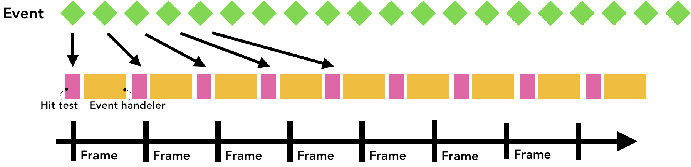
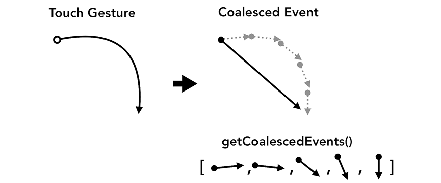

# 4、到达合成线程的输入

<page-tags text="发布于：2021-07-18"></page-tags>

在前面的篇章中我们探索了浏览器如何将我们的代码渲染成页面，我们了解了渲染进程和合成器。在本篇中我们将探索合成器是如何流畅地响应用户输入的。

## 从浏览器的角度来看输入事件

一般我们认为的输入事件只有输入框输入或者鼠标点击事件，但是从浏览器的角度来看任何手势操作都是输入。鼠标滚动、触摸操作、鼠标悬停这些对浏览器来说都是输入事件。

当用户触摸屏幕时，浏览器进程是最先收到这个手势事件的。但是浏览器进程仅仅是知道事件是在哪里发生的，并不能直接响应用户的操作，因为```tab```里面的内容都是由渲染进程来处理的。所以浏览器进程会将事件类型（比如```touchstart```）和事件发生的位置坐标发送给渲染进程。渲染进程收到事件后会去找到对应的事件对象然后执行相应的事件监听器。


<center style="font-size:14px;text-decoration:underline">通过浏览器进程传递到渲染进程的输入事件</center>

## 合成器收到输入事件


<center style="font-size:14px;text-decoration:underline">视口悬停在页面图层上</center>

在前面的篇章中，我们讨论过合成器是如何通过合成栅格化图层来平滑的处理滚动的。如果当前页面没有事件监听绑定，合成线程会创建一个新的完全独立于主线程的合成帧。但是如果页面中绑定了事件监听呢？合成器线程如何得知事件是否需要处理呢？

## 了解非快速滚动区域（non-fast scrollable region）

由于运行```js```代码是主线程的任务，当页面合成时合成线程会将页面中绑定了事件监听的部分标记为“非快速滚动区域”（````"Non-Fast Scrollable Region"```）。当这个区域中的事件触发时，通过这个标记合成线程可以确保将输入事件发送给主线程。如果输入事件来自于这个区域之外，合成线程会继续合成新的帧，而不会等待主线程。


<center style="font-size:14px;text-decoration:underline">来自非快速滚动区域的输入事件</center>

### 写事件监听的注意事项

在写事件监听时我们经常会用到事件委托。基于事件冒泡机制我们可以在顶层元素上监听事件。

```js
document.body.addEventListener('touchstart', event => {
    if (event.target === area) {
        event.preventDefault();
    }
});
```

这样的好处是，当有多个元素需要绑定相同的事件时，不需要单独的为每个元素都绑定事件。但是从浏览器的角度来讲这样做可能会导致不必要的区域也会被标记为非快速滚动区域。如果我们不关心页面其他区域的输入事件，但是当这些区域发生事件时合成线程还是不得不等待主线程处理完这些事件才能继续干活。因此合成器提供流畅用户体验的能力就大打折扣了。

<center style="font-size:14px;text-decoration:underline">整个区域都是非快速滚动的区域</center>

你可以通过```passive: true```参数告诉浏览器，当事件发生时主线程继续监听处理事件，合成线程不再等待并继续合成新的帧。

```js
document.body.addEventListener('touchstart', event => {
    if (event.target === area) {
        event.preventDefault()
    }
 }, {passive: true});
```

## 查找事件对象


<center style="font-size:14px;text-decoration:underline">主线程查看绘制记录，询问x,y坐标点上绘制了什么</center>

当合成器线程向主线程发送输入事件时，首先要运行的是命中测试来找到事件目标。命中测试使用渲染过程中生成的绘制记录数据来找出发生事件的坐标对应的内容。

## 缩减发送都主线程的事件数

我们知道设备刷新频率通常是在```60次/s```，页面的渲染频率跟这个频率保持一致我们可以得到顺畅的动画效果。但是对于输入事件，通常的触摸屏设备每秒传递```60-120``` 次触摸事件，鼠标每秒传递 ```100次```事件，输入事件的传递频次是高于设备的刷新频率的。

如果一个连续的事件比如```touchmove```以每秒```120次```的频率发送给主线程，那么与屏幕的刷新速度比，它可能会触发过多的命中测试和 ```JavaScript``` 执行。


<center style="font-size:14px;text-decoration:underline">过多触发事件导致页面卡顿</center>

为了减少过量的主线程调用，Chrome将连续事件（例如：```wheel```，```mousewheeel```,```mousemove```,```pointermove```,```touchmove```）并将调度延迟到下一个 ```requestAnimationFrame``` 之前。


<center style="font-size:14px;text-decoration:underline">合并并且延迟发送</center>

非连续性的事件比如 ```keydown```, ```keyup```, ```mouseup```, ```mousedown```, ```touchstart```, 和  ```touchend```，这些事件都是立即发送。

## 使用 ```getCoalescedEvents``` 获取帧内事件

对于大多数应用来说，合成事件就足够用来提供良好的用户体验了。但是如果是开发绘图应用，需要基于 ```touchmove``` 坐标放置路径之类的功能，如果使用合成事件就可能会丢失中间的某些坐标，难以画出平滑的曲线。在这种情况下可以在```pointer```事件中使用 ```getCoalescedEvents``` 方法来获取有关这些合并事件的信息。


<center style="font-size:14px;text-decoration:underline">左边是使用后的效果，右边是使用前的效果</center>

```js
window.addEventListener('pointermove', event => {
    const events = event.getCoalescedEvents();
    for (let event of events) {
        const x = event.pageX;
        const y = event.pageY;
        // draw a line using x and y coordinates.
    }
});
```

## 番外

### 使用 ```Lighthouse```

使用[Lighthouse](https://developers.google.com/web/tools/lighthouse)工具。```Lighthouse```可以评估你的网站，分析出哪些地方做得好哪些地方需要改进，分析完成后以报告的形式给出。结合报告可以做一些针对性的优化操作。

### 评估网站性能

不同的网站需要不同的优化策略。所以要学会评估网站的性能瓶颈找出需要优化的点。可以参考[how to measure your site's performance](https://developers.google.com/web/tools/chrome-devtools/speed/get-started)

### 添加功能策略

更进一步，可以了解一下```Feature Policy```这个新的```Web```平台功能，这个功能可以在你构建项目的时候提供一些保护让你的应用具有某些行为并防止你犯下错误。例如，如果你想确保你的应用代码不会阻塞页面的解析，你可以在同步脚本策略中运行你的应用。具体做法是将```sync-script```设置为```'none'```，这样那些会阻塞页面解析的```JavaScript```代码会被禁止执行。这样做的好处是避免你的代码阻塞页面的解析，而且浏览器无须担心解析器（```parser```）暂停。

## 参考资料

[inside-browser-part4](https://developers.google.com/web/updates/2018/09/inside-browser-part4)
