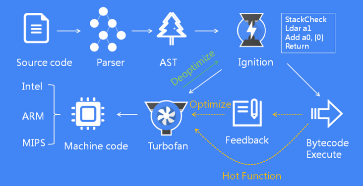

# JS引擎工作原理详解

作为前端开发了解```javascript```引擎的原理和工作流程是很有必要的。

## ```Javascript```引擎的工作原理


```Javascript```引擎的工作原理基本都大同小异，整体流程上分为以下步骤：

1. 将```Javascript```代码解析为```ATS```（抽象语法树）。
2. 基于```AST```，解释器（```interpreter``` ）将```AST```转化为字节码（```bytecode```），这一步js引擎实际上已经在执行js代码了。
3. 为了进一步的优化，优化编译器（```optimizing compiler```）将热点函数优化编译为机器指令（```machine code```）执行。
4. 如果**优化假设**失败，优化编译器会将机器码回退到字节码。
   
如果对上述流程有疑问，别着急，接下来会有详细解释。
   

### 各大主流浏览器```js```引擎对比

在了解V8的具体工作流程之前，我们先来看看各大浏览器的js引擎具体的工作流程是怎样的。

上面也提到，````js```引擎工作的流程大致是一致的：
* 解释器负责快速的生成没有优化过的字节码，
* 优化编译器负责生成优化过后的机器码但是相对来说花的时间会长一些。

但是不同```js```引擎的优化过程和策略会有一些区别。

#### ```V8```引擎


```V8``` 引擎用于```Chrome```和```NodeJs```中。```V8```的解释器叫做```Ignition```，负责产生和执行字节码。

```Ignition```在执行字节码的过程中会收集分析数据用于后续的优化。例如当一个函数经常被调用执行，这个函数就会变成热点函数，这个时候字节码和分析数据就被传递给优化编译器做进一步的优化的处理。

```V8```的优化编译器叫做```TurboFan```，根据分析数据产生高度优化的机器指令。

#### ```SpiderMonkey```引擎

 

```SpiderMonkey```是```Mozilla```的```js```引擎，用于```Firefox``` 和 [```SpiderNode```](https://github.com/mozilla/spidernode)。 

```SpiderMonkey```有两个优化编译器。解释器将字节码交给```Baseline```编译器，```Baseline```编译器会优化部分代码并执行，执行过程中会产生分析数据。结合分析数据```IonMonkey```编译器会生成高度优化的代码。如果优化失败，```IonMonkey```会将代码回滚到```Baseline```产生的代码。

#### ```Chakra```引擎


```Chakra``` 是微软的```js```引擎，用于```Edge```和[```Node-ChakraCore```](https://github.com/nodejs/node-chakracore)。

```Chakra``` 同样也有两个优化编译器。解释器将字节码交给```SimpleJIT```编译器，```SimpleJIT```做部分优化。结合分析数据```FullJIT```编译器会生成高度优化的代码。如果优化失败，```FullJIT```将代码回滚到字节码。

#### ```JavaScriptCore```引擎


```JavaScriptCore```（缩写```JSC```），是苹果的```js```引擎用于```Safari```和```React Native```。

```JSC```引入了三个优化编译器。```LLInt```解释器 （```the Low-Level Interpreter```） 将代码交给```Baseline```编译器，```Baseline```优化过后将代码交给```DFG``` (```Data Flow Graph```)编译器，最后```DFG```将代码交给```FTL``` (```Faster Than Light```) 编译器。


通过对比其实不难发现，```js```引擎的整体架构基本都是相同的，都是 ```parser -> interpreter -> compiler```。 那为什么有些只有一个优化编译器而有些又有多个呢？其实是为了做一些权衡。

**解释器（```interpreter```）能够快速的生成可执行的代码，但是代码的执行效率不高。编译器呢需要多花些时间来做编译优化，但是最后生成的是可以高效执行的机器码。** 所以这里就需要权衡到底是要```快速生成并执行```还是要 ```多花些时间生成并高效执行```，一些引擎引入多个具有不同时间/效率特性的优化编译器，以增加复杂性为代价，就是为了对这些权衡做更细粒度的控制。这中间还涉及到内存的权衡，机器码比字节码会占用更多的内存，接下来会详细讲解。
### ```js```引擎的优化权衡


```js```引擎在优化过程中做的权衡，核心点就是上面讲到的 **解释器能够快速的生成可执行的代码，但是代码的执行效率不高。编译器呢需要多花些时间来做编译优化，但是最后生成的是可以高效执行的机器码** 

通过下面这个例子来看看各大浏览器的处理过程：

```js
let result = 0;
for (let i = 0; i < 4242424242; ++i) {
	result += i;
}
console.log(result);
```


#### v8引擎

```V8```在```Ignition```解释器中生成字节码并执行，在这个执行过程中```V8```会收集一些```多次执行函数```的分析数据，这些函数叫做```热点函数```，紧接着就会启动```TurboFan  frontend```， ```TurboFan  frontend```是```TurboFan```编译器的一部分，专门负责集成分析数据和构建代码的基础机器表示。随后这部分结果被发送到另一个线程上的 ```TurboFan``` 优化器（```TurboFan optimizer```）被进一步优化。


当优化器在运行时，```V8```继续执行```Ignition```编译器中的字节码。当优化完成并生成了可执行的机器码，随后```V8```就以机器码来接替执行。

> 在2021年发布的```Chrome 91```中，V8在```Ignition``` 和 ```TurboFan```中间增加了一个新的编译器```Sparkplug```


#### ```SpiderMonkey```引擎

```SpiderMonkey``` 也是在解释器中生成字节码然后执行，它还多了一个额外的```Baseline```层，热点函数首先被发送到```Baseline```编译器 （```Baseline compiler```），```Baseline```编译器在主线程中生成```Baseline code```，然后以```Baseline code```接替执行。


```Baseline code``` 执行一定时间后，```SpiderMonkey```会启动```IonMonkey frontend```接着在另一个线程中启动```IonMonkey optimizer```。这个过程就和```V8```非常相似了，在优化过程中还是执行````Baseline code```，当优化完成后就以最后优化完成的代码接替执行。

#### ```Chakra``` 引擎

```Chakra``` 引擎的做法是将编译器完全独立到一个专用的进程中。```Chakra```将字节码和编译器可能需要的分析数据复制出来然后发送给编译器，这样做的好处是不会阻塞主线程的执行。


当```SimpleJIT```编译器生成代码以后```Chakra```就开始执行```SimpleJIT```的代码。同理```FullJIT```的处理过程也是类似。这样的好处是复制的时间通常比运行整个编译器（```frontend```部分）的时间短。但其缺点在于这种启发式复制可能会遗漏某些优化所需的某些信息，因此它在一定程度上是用代码质量来换取时间。


#### ```JavaScriptCore``` 引擎

在```JavaScriptCore```中编译器完全独立于主线程，主线程触发编译过程，编译器然后使用一套复杂的加锁机制从主线程获取分析数据。


这种方式的优点是减少了主线程上因优化而产生的阻塞，缺点是需要处理一些多线程的问题还有因为各种操作而产生的加锁消耗。


#### 内存使用权衡

上面一直在讨论**生成快跑得慢，生成慢跑得快的问题**，实际上还有一个需要权衡的因素，那就是内存的使用。前面也简单的提到过，机器码会比字节码占用更多的内存。下面通过一个例子来看看为什么。

```js
function add(x, y) {
	return x + y;
}

add(1, 2);
```
这里声明并执行了一个两数相加的函数。以```V8```为例，通过```Ignition```生成的字节码如下：

```code
StackCheck
Ldar a1
Add a0, [0]
Return
```

读不懂没关系，重点是这里生成的字节码只有**短短四行**

如果```add```函数被调用多次，```add```函数就会变成热点函数，```TurboFan``` 就会进一步生成高度优化的机器码，如下：

```code
leaq rcx,[rip+0x0]
movq rcx,[rcx-0x37]
testb [rcx+0xf],0x1
jnz CompileLazyDeoptimizedCode
push rbp
movq rbp,rsp
push rsi
push rdi
cmpq rsp,[r13+0xe88]
jna StackOverflow
movq rax,[rbp+0x18]
test al,0x1
jnz Deoptimize
movq rbx,[rbp+0x10]
testb rbx,0x1
jnz Deoptimize
movq rdx,rbx
shrq rdx, 32
movq rcx,rax
shrq rcx, 32
addl rdx,rcx
jo Deoptimize
shlq rdx, 32
movq rax,rdx
movq rsp,rbp
pop rbp
ret 0x18
```
跟上面的字节码比起来代码量剧增，字节码和优化过的机器码比起来通常要少得多。字节码需要解释器才能执行，而优化过的机器码可以由处理器直接执行。

这也解释了```js```引擎为什么不优化所有的代码。一个原因是上面讲到的优化需要花一定的时间，最主要的原因还是机器码会占用更多的内存。


**小结：**

```js```引擎拥有不同的优化层是为了权衡**生成快跑得慢，生成慢跑得快的问题**。使用多个优化层可以做出更细粒度的决策，但是会引入额外的复杂性和开销。另外还需要权衡优化级别和代码的内存占用。这也解释了为什么```JS```引擎只会尝试优化热点函数的原因。

## ```V8``` 引擎工作流程详解

再通过一张图来回顾一下```V8``` 引擎工作的基本流程：

接下来详细的分析一下这个过程

### 词法分析

解析过程实际上分为两步: **扫描器（```scanner```）** 做词法分析，**语法分析器（```parser```）** 做语法分析。

我们知道```JS```代码实际上只是一串字符串，机器是无法直接执行的，需要经过一系列的转换。词法分析就是把代码中的字符串分割出来，生成一系列的```token```。

**token：** 词义单位，是指语法上不能再分割的最小单位，可能是单个字符，也可能是一个字符串。

那具体的token长什么样呢，通过一个例子来说明：

```js
function foo() {
  let bar = 1;
  return bar;
}
```

这段代码经过词法分析过程生成如下```token```列表：

```JSON
[
    {
        "type": "Keyword",
        "value": "function"
    },
    {
        "type": "Identifier",
        "value": "foo"
    },
    {
        "type": "Punctuator",
        "value": "("
    },
    {
        "type": "Punctuator",
        "value": ")"
    },
    {
        "type": "Punctuator",
        "value": "{"
    },
    {
        "type": "Keyword",
        "value": "let"
    },
    {
        "type": "Identifier",
        "value": "bar"
    },
    {
        "type": "Punctuator",
        "value": "="
    },
    {
        "type": "Numeric",
        "value": "1"
    },
    {
        "type": "Punctuator",
        "value": ";"
    },
    {
        "type": "Keyword",
        "value": "return"
    },
    {
        "type": "Identifier",
        "value": "bar"
    },
    {
        "type": "Punctuator",
        "value": ";"
    },
    {
        "type": "Punctuator",
        "value": "}"
    }
]
```
可以看到实际上就是把代码做了拆分，拆分成不同类型的表示。

可以通过[esprima](https://esprima.org/demo/parse.html#)做在线解析

### 语法分析 （```parser```）

词法分析完成后，紧接着就是进行语法分析。语法分析的输入就是词法分析的输出，输出是**AST抽象语法树**， ```AST```是表示```token```关系的一棵树，它是源代码语法结构的一种抽象表示，它以树状的形式表现语法结构，树上的每个节点都表示代码中的一种结构。当代码中有语法错误的时候，```V8```在语法分析阶段抛出异常。

还是上面那段代码，生成的AST如下：

```JSON
{
  "type": "Program",
  "body": [
    {
      "type": "FunctionDeclaration",
      "id": {
        "type": "Identifier",
        "name": "foo"
      },
      "params": [],
      "body": {
        "type": "BlockStatement",
        "body": [
          {
            "type": "VariableDeclaration",
            "declarations": [
              {
                "type": "VariableDeclarator",
                "id": {
                  "type": "Identifier",
                  "name": "bar"
                },
                "init": {
                  "type": "Literal",
                  "value": 1,
                  "raw": "1"
                }
              }
            ],
            "kind": "let"
          },
          {
            "type": "ReturnStatement",
            "argument": {
              "type": "Identifier",
              "name": "bar"
            }
          }
        ]
      },
      "generator": false,
      "expression": false,
      "async": false
    }
  ],
  "sourceType": "script"
}
```

后续会专门针对```AST```写一片文章详解。
### 解释器 （```Ignition```）

生成```AST```树后，就是根据```AST```来生成字节码，这一步由```V8```的```Ignition```编译器来完成。同时Ignition会执行字节码。在这个执行过程中，如果一个函数被调用多次，这个函数就会被标记为热点函数，并将该函数的字节码以及执行的相关信息发送给```TurboFan```进行优化处理。

这一步的特点是：```V8```可快速生成字节码，但是字节码的执行效率不高。

###  编译器（```TurboFan```）


```TurboFan```会根据执行信息做出进一步优化代码的假设，在假设的基础上将字节码编译为优化的机器代码。如果假设成立，那么当下一次调用该函数时，就会执行优化编译后的机器代码，以提高代码的执行性能。如果假设失败就会进行回退操作，就是上图中```Deoptimize``` 这一步，把机器码还原为字节码。


那什么是假设？ 什么要进行回退呢？还是通过一个例子来阐述：
```js
function sum (a, b) {
    return a + b;
}
```

```JavaScript```动态类型的语言，这里```a```和```b```可以是任意类型数据，当执行```sum```函数时，```Ignition```解释器会检查```a```和```b```的数据类型，并相应地执行加法或者连接字符串的操作。

如果 ```sum```函数被调用多次，每次执行时都要检查参数的数据类型是很浪费时间的。此时```TurboFan```就出场了。它会分析函数的执行信息，如果以前每次调用```sum```函数时传递的参数类型都是数字，那么```TurboFan```就预设```sum```的参数类型是数字类型，然后将其编译为机器码。

但是如果某一次的调用传入的参数不再是数字时，表示```TurboFan```的假设是错误的，此时优化编译生成的机器代码就不能再使用了，于是就需要进行回退到字节码的操作。


相信看到这里大家已经对浏览器大概的执行流程有了一个宏观上的认识了。


## 参考资料
* [JavaScript engine fundamentals: optimizing prototypes](https://mathiasbynens.be/notes/prototypes)
* [JavaScript engine fundamentals: optimizing prototypes](https://mathiasbynens.be/notes/prototypes#tradeoffs)
* [How JavaScript Works: Under the Hood of the V8 Engine](https://www.freecodecamp.org/news/javascript-under-the-hood-v8/)
* [JavaScript 引擎（V8）是如何工作的](https://segmentfault.com/a/1190000022062181#:~:text=%E5%9C%A8V8%20%E4%B8%AD%E6%9C%89%E4%B8%A4,%E4%BB%A5%E5%8F%8A%E7%A1%AE%E5%AE%9A%E8%AF%8D%E6%B3%95%E4%BD%9C%E7%94%A8%E5%9F%9F%E3%80%82)


* [How JavaScript works: an overview of the engine, the runtime, and the call stack](https://blog.sessionstack.com/how-does-javascript-actually-work-part-1-b0bacc073cf)


* [What the heck is the event loop anyway? | Philip Roberts | JSConf EU](https://www.youtube.com/watch?v=8aGhZQkoFbQ)
* [How JavaScript works: Event loop and the rise of Async programming + 5 ways to better coding with async/await](https://blog.sessionstack.com/how-javascript-works-event-loop-and-the-rise-of-async-programming-5-ways-to-better-coding-with-2f077c4438b5)
* [Tasks, microtasks, queues and schedules](https://jakearchibald.com/2015/tasks-microtasks-queues-and-schedules/)
* [JavaScript Engines: An Overview](https://blog.bitsrc.io/javascript-engines-an-overview-2162bffa1187)

* [How JavaScript works: the rendering engine and tips to optimize its performance](https://blog.sessionstack.com/how-javascript-works-the-rendering-engine-and-tips-to-optimize-its-performance-7b95553baeda)
* [Deep Dive in to JavaScript Engine - (Chrome V8)](https://dev.to/edisonpappi/how-javascript-engines-chrome-v8-works-50if)
* [JavaScript 引擎 V8 执行流程概述](https://mp.weixin.qq.com/s/t__Jqzg1rbTlsCHXKMwh6A)
* [视野前端（二）V8引擎是如何工作的](https://mp.weixin.qq.com/s?__biz=MzI4NjE3MzQzNg==&amp;mid=2649865842&amp;idx=1&amp;sn=b595dbd13328ce65aa265eb21ba4ea85&amp;chksm=f3e5efe1c49266f7f86bf899cd5f80d4864e21bbedc3f03170762c3f44f573d0c33eb44399de&amp;mpshare=1&amp;scene=24&amp;srcid=&amp;sharer_sharetime=1583838316032&amp;sharer_shareid=3ebcb61ec5c32d188c9235d1a89dcfbf#rd)