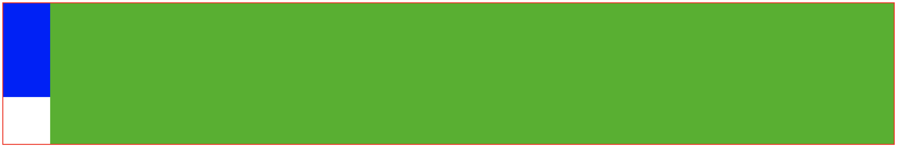
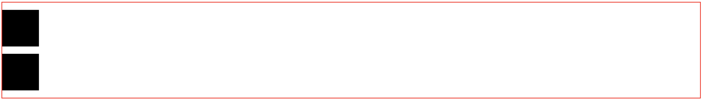
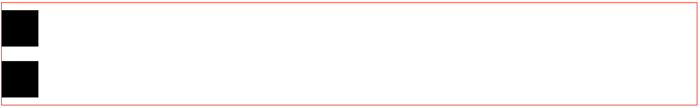

# BFC

说到css的布局原理就不得不谈到BFC的概念，了解这个概念能够加深我们对布局的理解。
##  什么是BFC
BFC（Block Formatting Context），中文直译为块级格式化上下文。它决定了元素如何对其内容进行定位，以及与其他元素的关系和相互作用。简单来说，可以把它理解为一个独立的容器，这个容器中元素的布局与容器外的布局之间不会相互影响。
## 创建BFC

常见的能够创建块格式化上下文的方式：

1. 根元素html；

2. float属性值不为none；

3. position属性值为absolte或者fixed；

4. display属性值为inline-block、flex、inline-flex、table-cell、table-caption；

5. overflow属性值不为visible。


## BFC 的布局规则

1. 内部的Box会在垂直方向，一个接一个地放置。
2. **属于同一个BFC的两个相邻Box的margin会发生重叠**
3. 每个元素的margin box的左边， 与包含块border box的左边相接触(对于从左往右的格式化，否则相反)。即使存在浮动也是如此。
4. **BFC的区域不会与float box重叠。**
>说明
>>当容器有足够的剩余空间容纳 BFC 的宽度时，所有浏览器都会将 BFC 放置在浮动元素所在行的剩余空间内。 
当 BFC 的宽度大于容器剩余宽度时，最新版本的浏览中只有firefox会在同一行显示，其它浏览器均换行。
5. BFC就是页面上的一个隔离的独立容器，容器里面的子元素不会影响到外面的元素。反之也如此。
6. **计算BFC的高度时，浮动元素也参与计算。**

## BFC 原理的应用

了解了BFC的原理，那么怎么应用BFC的原理呢，通过下面的示例一起来看看。


### 1. BFC 可以阻止元素被浮动元素覆盖(两栏布局右侧自适应)
```html
<!DOCTYPE html>
<html>
<head>
    <style>
        .parent {
            border: 2px solid red;
        }
        .child1 {
            width: 100px;
            height: 200px;
            background: blue;
            float: left;
        }
        .child2 {
            background: #2db200;
            height: 300px;
        }
    </style>
</head>
<body>
<div class="parent">
    <div class="child1"></div>
    <div class="child2"></div>
</div>
</body>
</html>
```


根据规则3我们来分析一下:
>每个元素的margin-box的左边，与包含块border-box的左边相接触(对于从左往右的格式化，否则相反)。即使存在浮动也是如此。
 
所以我们看到child1，child2的左边与parent的左边相接触。我们看到child1，child2发生了重叠，现在我们想child1，child2不发生重叠我们应该怎么做呢，我们看规则4:

>BFC的区域不会与float box重叠。

 ```css
.child2 {
    background: #2db200;
    height: 300px;
    overflow: auto;
}
```
通过给 child2 加上 `overflow: auto` 产生 BFC：


 
这样child1，child2就分开了。
### 2. 清除浮动
```html
<!DOCTYPE html>
<html>
<head>
    <style>
        .parent {
            border: 2px solid #eeeeee;
        }
        .child {
            width: 100px;
            height: 100px;
            background: #000;
            float: left;
        }
    </style>
</head>
<body>
<div class="parent">
    <div class="child"></div>
</div>
</body>
</html>
```


由于child设置了浮动，脱离了文档流，造成了parent高度的塌陷。根据规则6，**BFC在计算元素的时候也会把浮动元素算进去**。那么触发parent生成BFC试试，代码中加入:

```css
.parent {
    border: 2px solid red;
    overflow: auto;
}
```


可以看到parent元素的高度被撑了起来。这样就达到了清除浮动的目的。

### 3. 防止margin重叠

由第二条规则可知**属于同一个BFC的两个相邻Box的 margin 会发生重叠**,  这不是css的bug，可以理解成一种规范。

```html
<!DOCTYPE html>
<html>
<head>
    <style>
        .parent {
            border: 2px solid red;
        }
        .child {
            width: 100px;
            height: 100px;
            background: #000;
            margin: 20px 0;
        }
    </style>
</head>
<body>
<div class="parent">
    <div class="child"></div>
    <div class="child"></div>
</div>
</body>
</html>
```



两个child的上下边距发生了重叠，边距只有20px而不是40px，那么不想让margin发生重叠怎么办呢？可以把child放到不同的BFC中。例如像下面这样：
```html
<!DOCTYPE html>
<html>
<head>
    <style>
        .parent {
            border: 2px solid red;
        }
        .child {
            width: 100px;
            height: 100px;
            background: #000;
            margin: 20px 0;
        }
        .wrap {
            overflow: auto;
        }
    </style>
</head>
<body>
<div class="parent">
    <div class="child"></div>
    <div class="wrap">
        <div class="child"></div>
    </div>
</div>
</body>
</html>
```



增加了 wrap 元素，设置wrap元素产生BFC，这样边距就是40px了。
 
## 小结

BFC原理还是非常有意思的，对理解常见的布局方式很有帮助，以前布局只是知其然不知其所以然，学习了BFC后不用死记硬背了。

## 参考资料

* [10 分钟理解 BFC 原理](https://zhuanlan.zhihu.com/p/25321647)
* [BFC原理详解](https://segmentfault.com/a/1190000006740129)
* [前端精选文摘：BFC 神奇背后的原理](https://www.cnblogs.com/lhb25/p/inside-block-formatting-ontext.html)