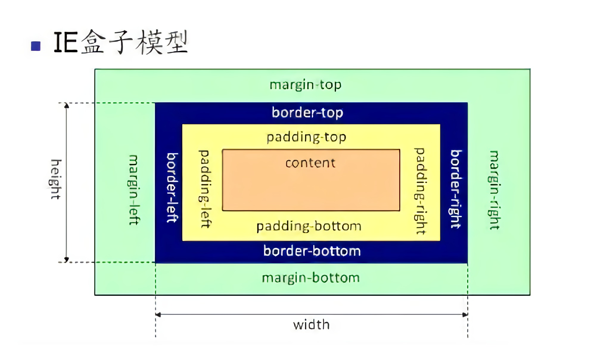

# CSS 盒模型

### 概念

浏览器在渲染元素的时候，所有的元素都会以一个矩形盒子的形式展示出来，准确理解 CSS 盒模型的概念，对于理解元素的大小至关重要。

盒模型又分为 **IE盒模型** 和 **W3C标准盒模型**，当我们需要计算元素大小的时候根据不同的盒模型会得到不同的结果，关键点在于 css 属性 width/height 的含义。

计算规则如下：

1. W3C标准盒模型：


* 设置的 css width = content 的宽度
* 设置的 css height = content 的高度
* 元素的真实宽度 = "content 的宽度" + "border-left-width" + "border-right-width" + "padding-left" + "padding-right"
* 元素的真实高度 = "content 的高度" + "border-top-width" + "border-bottom-width" + "padding-top" + "padding-bottom"

2. IE盒模型：



* 在设置的 border + padding 小于等于设置的宽高的情况下
  * 设置的 css width = "content 的宽度" + "border-left-width" + "border-right-width" + "padding-left" + "padding-right"
  * 设置的 css height = "content 的高度" + "border-top-width" + "border-bottom-width" + "padding-top" + "padding-bottom"
  * 元素的真实宽度 = 设置的 css width
  * 元素的真实高度 = 设置的 css height

* 否则
  * 元素的真实宽度 = "border-left-width" + "border-right-width" + "padding-left" + "padding-right"
  * 元素的真实高度 = "border-top-width" + "border-bottom-width" + "padding-top" + "padding-bottom"

**W3C标准中盒模型可以通过 css 的 box-sizing 属性进行切换**

下面通过一个例子来验证一下上述规则：

```html
<!DOCTYPE html>
<html>
  <head>
    <style type="text/css">
      .hello {
        width: 200px;
        height: 200px;
        background-color: red;
        padding: 10px;
        border: 10px solid black;
        margin-bottom: 10px;
        /* box-sizing: border-box; */
      }
    </style>
  </head>
  <body>
    <div class="hello"></div>
  </body>
</html>
```

默认情况下`box-sizing:content-box` 是标准盒模型。在chrome中打开，选中元素，查看元素宽度：


可以看到元素的真实宽高是240，而不是200 因为现在是标准盒模型，设置的宽高是content的宽高，元素的真实宽高满足 W3C 标准盒子模型的计算规则，所以宽高是240。

去掉注释，此时 `box-sizing: border-box;` 为 IE 盒模型


此时元素的真实宽高就等于设置的宽高，满足IE盒模型的计算规则。对于 border宽度加padding大于设置的宽高的场景，留给大家自己实践验证。

**总结：**

两种盒子模型：W3C标准盒模型、IE盒模型。

区别在于width和height：

* W3C标准盒模型设置的width和height指的是content的宽度和高度，
* IE盒模型设置width和height指的是content+padding+border （padding+border 小于等于宽高的情况下）。
* 可通过box-sizing 来切换两种模式。
  * content-box(设置为标准盒模型)
  * border-box(设置为IE盒模型)。
