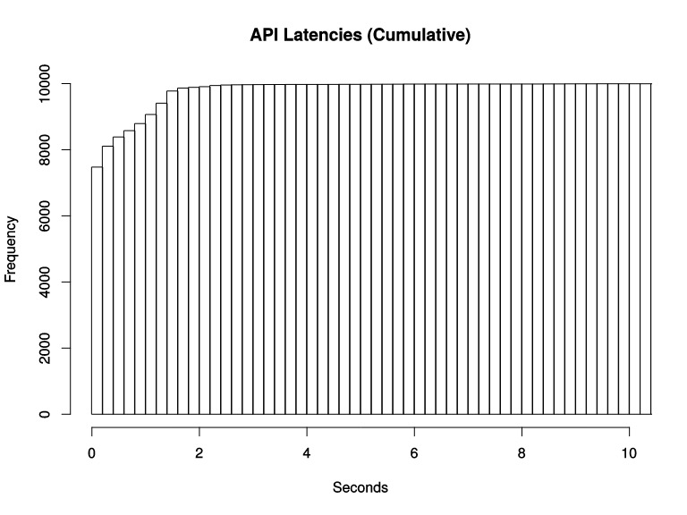

# 直方图 （Histogram）

除了Counter和Gauge类型的监控指标以外，Prometheus还定义了Histogram和Summary的指标类型。Histogram和Summary主用用于统计和分析样本的分布情况。
在大多数情况下人们都倾向于使用某些量化指标的平均值，例如CPU的平均使用率、页面的平均响应时间。这种方式的问题很明显，以系统API调用的平均响应时间为例：如果大多数API请求都维持在100ms的响应时间范围内，而个别请求的响应时间需要5s，那么就会导致某些WEB页面的响应时间落到中位数的情况，而这种现象被称为长尾问题。

为了区分是平均的慢还是长尾的慢，最简单的方式就是按照请求延迟的范围进行分组。例如，统计延迟在0~10ms之间的请求数有多少而10~20ms之间的请求数又有多少。通过这种方式可以快速分析系统慢的原因。Histogram和Summary都是为了能够解决这样问题的存在，通过Histogram和Summary类型的监控指标，我们可以快速了解监控样本的分布情况。

本文详细讲解什么是Histogram。

Histogram 会在一段时间范围内对数据进行采样（通常是请求持续时间或响应大小等），并将其计入可配置的存储桶（bucket）中。

假设我们想监控某个应用在一段时间内的响应时间，最后监控到的样本的响应时间范围为 0s~10s。现在我们将样本的值域划分为不同的区间，即不同的 bucket，每个 bucket 的宽度是 0.2s。

需要注意的点是Prometheus 的 histogram 是一种累积直方图，其实也很好理解：

每个 bucket 的宽度是 0.2s，那么第一个 bucket 表示响应时间小于等于 0.2s 的请求数量，第二个 bucket 表示响应时间小于等于 0.4s 的请求数量，以此类推。也就是说，每一个 bucket 的样本包含了之前所有 bucket 的样本，所以叫累积直方图。

## 参考资料
* https://segmentfault.com/a/1190000019987152
* https://www.jianshu.com/p/ccffd6b9e3d1