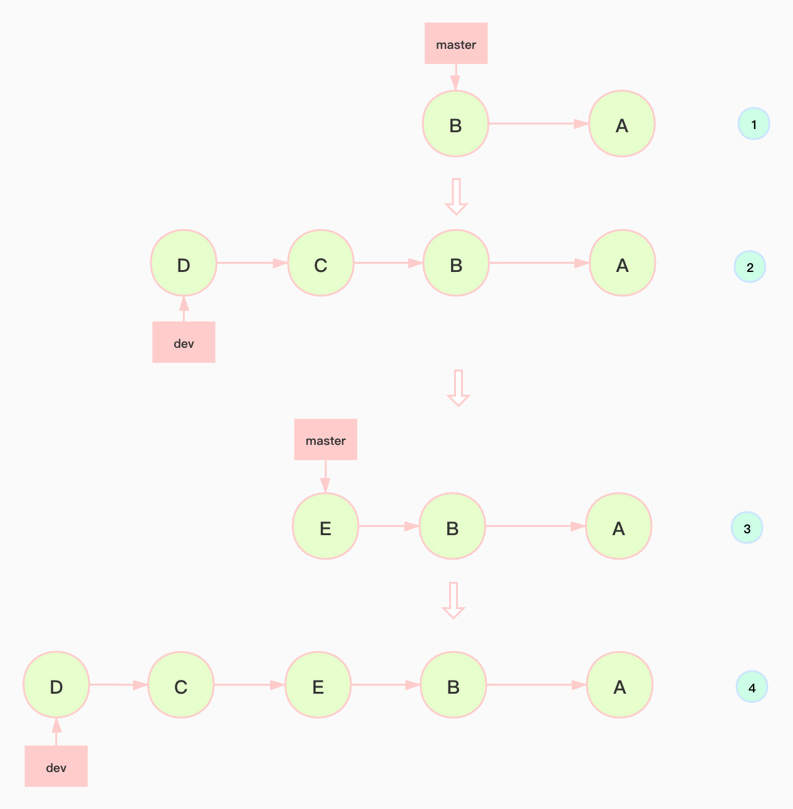
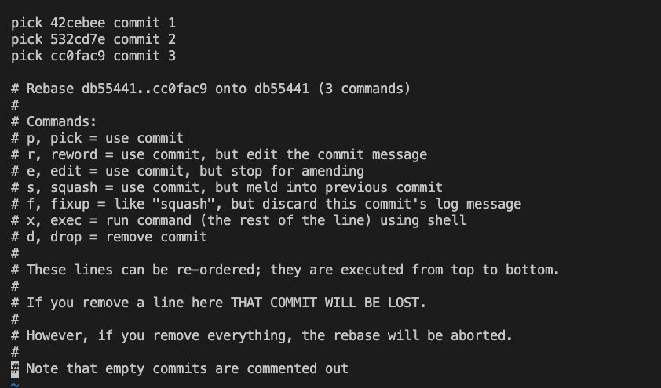
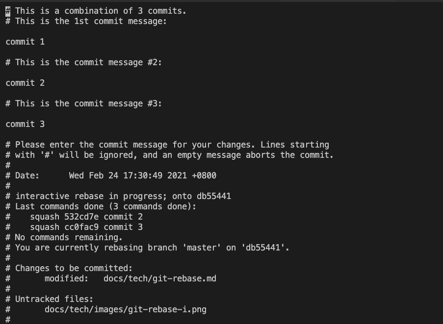

# git rebase 详解
平时工作中很少使用git rebase 这个命令，源于前段时间同事在我合并分支时让我先rebase一下，当时一脸懵逼。源于此这里学习总结一下git rebase 的具体使用方法和应用场景。
## 分支合并
git rebase 这个命令最常用的场景就是合并分支了吧，平时git merge使用比较多，但是git merge合并会产生一个合并commit，提交记录也会分叉，平时大家用得比较多，这里就不再赘述。但是如果你想维护一条干净整洁没有冗余commit的分支那么git rebase就派上用场了。



在这个场景中我们从master 分支中checkout出一个dev分支，然后在dev分支上做了D、C两次提交，在合并到master分支之前又有别的开发者在master上做了E提交，此时在dev分支上进行git rebase master操作，我们就可以得到 D->C->E->B->A的提交记录，然后再checkout 到master分支上执行git merge dev操作，此时master分支不会产生新的commit也不会分叉。那么这个过程发生了什么呢。

在dev分支上执行git rebase master 操作时，这个命令会将dev分支上的所有提交保存为patch，并存放到“.git/rebase”目录下，然后dev分支会去同步master上的最新提交，紧接着将dev上的patch接到dev分支上。这样看来也比较好理解了。

总结一下操作命令：

```bash
$ git checkout dev
# 执行这个命令后可能会产生一些冲突，解决完冲突后执行git add操作，然后执行 git rebase --continue
$ git rebase master
$ git checkout master
$ git merge dev
```
## 合并多个commit
记得有次面试，有个面试官问我，如果想把多个没有意义的commit合并成一个有意义的commit应该怎么做，这个也是git rebase的应用
场景之一。

下面我们举例来进行说明：

```bash
* cc0fac9 (HEAD -> master) commit 3
* 532cd7e commit 2
* 42cebee commit 1
```
这里有三个commit， 现在我们想把三个提交合并成一个,
执行命令：
```bash
git rebase -i HEAD~
```
这时出现交互式界面：



这里列出了几个命令：

```bash
# Commands:
# p, pick = use commit
# r, reword = use commit, but edit the commit message
# e, edit = use commit, but stop for amending
# s, squash = use commit, but meld into previous commit
# f, fixup = like "squash", but discard this commit's log message
# x, exec = run command (the rest of the line) using shell
# d, drop = remove commit
```

这里我们会用到pick和squash命令，
pick表示保留当前commit，
squash表示将当前commit与上一个commit合并。

修改命令后：

```bash
p 42cebee commit 1
s 532cd7e commit 2
s cc0fac9 commit 3
```
这里表示将的第2次，第3次commit合并到第一次commit上,

wq保存后退出。然后会进到下面的界面：



这里我们可以对commit message进行修改。修改完后执行wq保存退出。

现在再执行git log看一下，我们会发现三次commit合并成了一个：

```bash
commit a7e595a8d0bf0ad2ef4bd1bd4534ef80b4b32683
Author: antbaobao <2929712050@qq.com>
Date:   Wed Feb 24 17:30:49 2021 +0800

    代码合并
```

# 参考
* [分支合并](http://gitbook.liuhui998.com/4_2.html)
* [使用git rebase合并多次commit](https://juejin.cn/post/6844903600976576519)
* [Rebase 当前分支](https://www.liaoxuefeng.com/wiki/896043488029600/1216289527823648)
