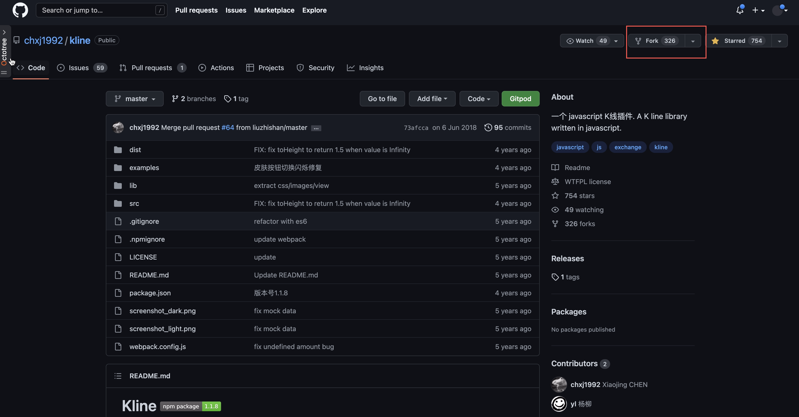
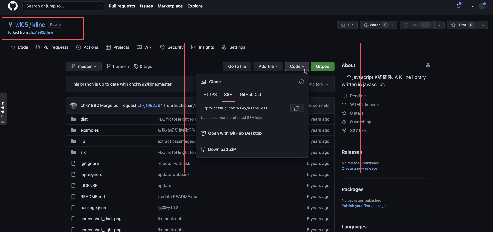
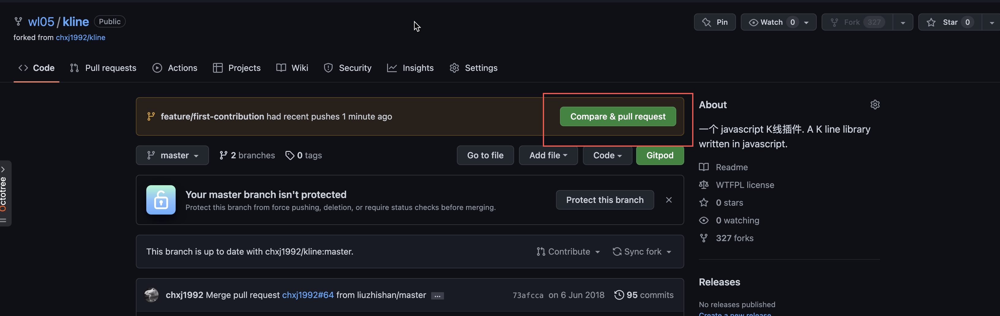
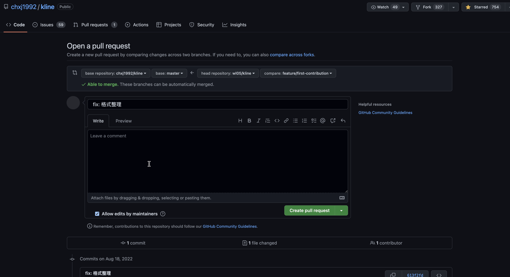
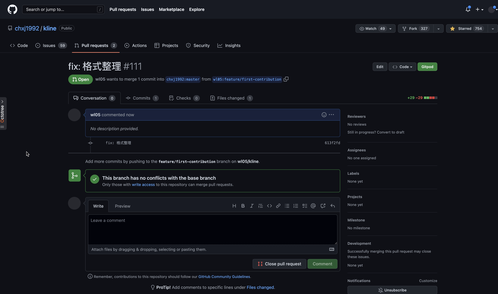

# pull request 小白教学

如果我们有意愿参与开源项目，学会提交 pull request 是第一步。

如果你正在看这篇文章说明这个技能你还不会，没关系花几分钟看完这篇文章就能上手了，那就闲话少说，跟着我一步步来，实际上很简单。


### 1. fork 你要参与的项目

以[kline](https://github.com/chxj1992/kline)项目例，对项目进行 fork。



### 2. 将 fork 过来的项目 clone 到本地

我们把 fork 过来的项目 clone 到本地。



执行命令：

```bash
$ git clone git@github.com:wl05/kline.git
```

### 3. 添加 upstream remote 

进入到项目目录

```bash
$ cd kline
```

查看一下当前的远程仓库

```
$ git remote -v
origin  git@github.com:wl05/kline.git (fetch)
origin  git@github.com:wl05/kline.git (push)
```

同时我们还需要将原项目仓库添加为上游远程仓库

```bash
$ git remote add upstream git@github.com:chxj1992/kline.git
```

添加完仓库地址后我们再查看下远程仓库：

```bash
$ git remote -v                                            
origin  git@github.com:wl05/kline.git (fetch)
origin  git@github.com:wl05/kline.git (push)
upstream        git@github.com:chxj1992/kline.git (fetch)
upstream        git@github.com:chxj1992/kline.git (push)
```

简单来讲：

* upstream 指的就是我们 fork 的那个项目也就是原项目
* origin 指的是我们从原项目 fork 过来的项目

添加 upstream 的目的是方便我们同步原项目中的改动。

例如原项目有修改我们要同步修改那么在本地我们可以直接拉取原项目。

```bash
$ git pull upstream master
From github.com:chxj1992/kline
 * branch            master     -> FETCH_HEAD
 * [new branch]      master     -> upstream/master
Already up to date.
```

### 4. 做出修改并提交代码

好了，现在准备工作做好了我们就可以开始做一些修改了，本着保证 master 分支纯净稳定的原则，我们先从本地 master 分支切出一个分支专门用来开发。
例如：

```bash
$ git checkout -b feature/first-contribution                           
Switched to a new branch 'feature/first-contribution'
```

做完修改、提交并push到 origin 远程仓库:

```bash
$ git add . 
$ git commit -m " fix: 格式整理" 
$ git push origin feature/first-contribution
```

### 5. 发起 pull request

上一步我们已经将代码 push 到 origin 仓库中，我们回到 github 刷新一下页面，



可以看到我们 push 上来的分支和 `Compare & pull request ` 按钮。点击按钮我们就可以发起 `pull request` 了。



在 `Open a pull request` 页面我们需要详细的描述一下我们的改动点，方便项目的负责人快速了解本次 pull request 的内容，在这个页面往下拉，可以看到我们做出的改动。方便我们进一步确认。

确认无误就可以点击 `Create pull request`, 完成后进入下面的页面



现在我们已经创建了 pull request。 在这个页面中我们可以进一步的查看 "Commits" 和 "Files changed" 进行 review。

同时后续在这个开发分支上修改并 push 到远程仓库后这个 pull request 会自动同步 commit 和 change。


### 总结

至此我们就完成了参与 github 开源项目的入门姿势，后续 pull request 是否被接受就要看项目负责人审查代码的结果了。

说一些题外话，参与到大型开源项目中对我们的提升无疑是巨大的，也许我们不能成为大型项目的核心开发者但是解决一些别人提出来的 issue 和 bug 还是非常具有可行性的。

例如参与解决一些大型框架的 bug，如果要解决问题必然要求我们对框架足够熟悉，

那就要求我们必须去了解框架的整体架构、实现原理然后局部到细节，这样参与其中对我们的提升无疑是巨大的。


## 参考资料

* [Step-by-step guide to contributing on GitHub](https://www.dataschool.io/how-to-contribute-on-github/)
* [What is the difference between origin and upstream on GitHub?](https://stackoverflow.com/questions/9257533/what-is-the-difference-between-origin-and-upstream-on-github/9257901#9257901)