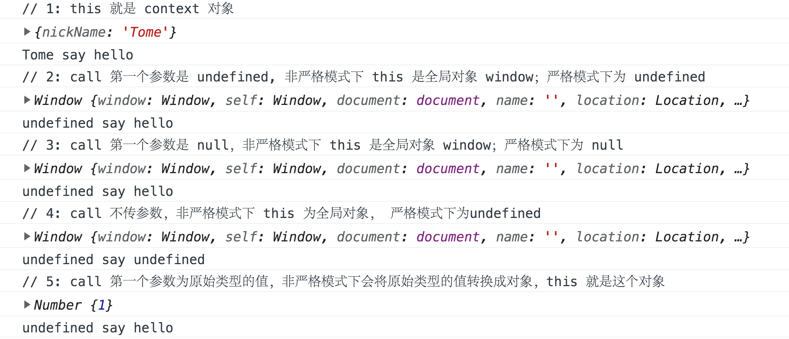

# 前端手写题

## 实现防抖函数（debounce）

概念：在事件被触发n秒后再执行回调，如果在这n秒内又被触发，则重新计时。

适用场景： 搜索框搜索联想、优化resize事件等。

实现：

```html
<!-- 防抖函数实现 -->
<!DOCTYPE html>
<html>
  <head>
    <meta charset="utf-8" />
    <meta http-equiv="X-UA-Compatible" content="IE=edge" />
    <title>Debounce</title>
    <meta name="viewport" content="width=device-width, initial-scale=1" />
    <style>
      #search {
        width: 400px;
        margin-left: 300px;
        margin-bottom: 50px;
      }
      #showSearch {
        width: 800px;
        height: 100px;
        background: lightblue;
        color: red;
        margin-left: 300px;
      }
    </style>
  </head>
  <body>
    <input type="search" id="search" />
    <div id="showSearch"></div>
    <script>
      function debounce(fn, wait) {
        let timer
        return function () {
          const args = arguments
          const context = this // 保留函数执行时的this对象
          if (timer) {
            clearTimeout(timer)
          }
          timer = setTimeout(function () {
            fn.apply(context, args)
          }, wait)
          // 因为这里是在setTimeout的回调函数中执行，fn中的this在非严格模式下是指向window的，所以需要改变fn中this的指向，
          // 同时将接受到的参数传递给fn
        }
      }
      const showSearch = document.querySelector('#showSearch')
      const search = document.querySelector('#search')
      function getSearchInfo(e) {
        showSearch.innerText = this.value // 这里的this指向
      }
      search.onkeyup = debounce(getSearchInfo, 1000)
    </script>
  </body>
</html>
```

## 实现节流函数（throttle）

概念：每隔n秒执行一次事件，在这n秒内无论触发多少次事件最终只会执行一次

适用场景：优化用户点击过快等

实现：

```html
<!-- 防抖函数实现 -->
<!DOCTYPE html>
<html>
  <head>
    <meta charset="utf-8" />
    <meta http-equiv="X-UA-Compatible" content="IE=edge" />
    <title>Throttle</title>
    <meta name="viewport" content="width=device-width, initial-scale=1" />
  </head>
  <body>
    <script>
      // 实现方式1:
      // 这种方式会延迟到delay时间才会执行一次
      function throttle1(fn, delay) {
        let timer
        return function () {
          const context = this
          const args = arguments
          if (timer) {
            return
          }
          timer = setTimeout(function () {
            fn.apply(context, args)
            timer = null // 注意这里需要将timer置为null
          }, delay)
        }
      }

      // 实现方式2:
      // 这种方式会立刻触发一次，然后等delay时长后再触发
      function throttle2(fn, delay) {
        let previous = 0
        return function () {
          const now = Date.now()
          const args = arguments
          if (now - previous > delay) {
            fn.apply(this, args)
            previous = now
          }
        }
      }

      function testThrottle(e, content) {
        console.log(e, content)
      }

      const testThrottleFn = throttle2(testThrottle, 1000) // 节流函数
      document.onmousemove = function (e) {
        testThrottleFn(e, 'throttle') // 给节流函数传参
      }
    </script>
  </body>
</html>
```

## 用 Throttle 来优化 Debounce

## 深拷贝（deepclone）

## 实现Event(event bus)

## 实现instanceOf

## 模拟new

要模拟实现new关键字，首先我们要知道new关键字做了哪些事情。

new关键字后面跟的是构造函数或者class。参考 MDN 中对[new](https://developer.mozilla.org/en-US/docs/Web/JavaScript/Reference/Operators/new)关键字的介绍，可以总结几个关键点：

1. 创建一个空对象；
2. 给空对象添加__proto__属性，指向构造函数的prototype（原型）对象；
3. 将新创建的对象作为 this 上下文；
4. 如果构造函数返回一个对象，这个对象就是new操作的结果；如果构造函数返回的是原始类型或者不返回值则new操作的结果就是上面创建的对象。

根据上面的要点可以实现如下：

```js
function ObjFactory() {
  const obj = new Object() // 1. 创建一个空对象；
  const args = arguments
  const Constructor = Array.prototype.shift.call(args) // ObjFactory的第一个参数是构造函数，这里shift会改变args，剩下的都是传给构造函数的参数
  obj.__proto__ = Constructor.prototype // 2. 给空对象添加__proto__属性，指向构造函数的prototype（原型）对象；
  const res = Constructor.apply(obj, args) // 3. 将新创建的对象作为 this 上下文；
  return Object.prototype.toString.call(res) === '[object Array]' ||
    Object.prototype.toString.call(res) === '[object Object]' ||
    Object.prototype.toString.call(res) === '[object Function]'
    ? res
    : obj // 4. 如果构造函数返回一个对象，这个对象就是new操作的结果；如果构造函数返回的是原始类型或者不返回值则new操作的结果就是上面创建的对象。
}
const Person = function (name) {
  this.name = name
}

Person.prototype.sayHello = function () {
  console.log(`${this.name} say hello`)
}
const res = ObjFactory(Person, 'Tom')
res.sayHello()
```

## 实现一个call

实现 call 之前，还是先来看看 call 方法能做什么，首先要明确 call 是 Function.prototype 里面的方法，也就是说每个函数或者方法中都可以调用 call  方法，根据 MDN 中对 [call](https://developer.mozilla.org/en-US/docs/Web/JavaScript/Reference/Global_Objects/Function/call) 的介绍可以总结出以下几个要点：

1. call 方法的第一个参数用作调用 call 的函数中的this，后续传入的参数作为调用函数的参数。
2. 执行函数，函数的执行是在第一步的this和传参下进行。
3. 非严格模式下，如果 call 的第一个参数为 undefined、null 或者不传参数，this 指向全局对象；如果传入的是原始类型的值，this 是将原始类型转换为对象后的值。

```html
<!DOCTYPE html>
<html lang="en">
  <head>
    <meta charset="UTF-8" />
    <meta http-equiv="X-UA-Compatible" content="IE=edge" />
    <meta name="viewport" content="width=device-width, initial-scale=1.0" />
    <title>call</title>
  </head>
  <body>
    <script>
      const context = {
        nickName: 'Tome'
      }
      function say(word) {
        console.log(this)
        console.log(`${this.nickName} say ${word}`)
      }
      console.log('// 1: this 就是 context 对象 ')
      say.call(context, 'hello')
      console.log('// 2: call 第一个参数是 undefined, 非严格模式下 this 是全局对象 window；严格模式下为 undefined')
      say.call(undefined, 'hello')
      console.log('// 3: call 第一个参数是 null，非严格模式下 this 是全局对象 window；严格模式下为 null')
      say.call(null, 'hello')
      console.log('// 4: call 不传参数，非严格模式下 this 为全局对象， 严格模式下为 undefined')
      say.call()
      console.log('// 5: call 第一个参数为原始类型的值，非严格模式下会将原始类型的值转换成对象，this 就是这个对象')
      say.call(1, 'hello')
    </script>
  </body>
</html>
```

打印结果如下：

<image-container>
  
</image-container>

根据这些要点可以模拟实现call方法：

```html
<!DOCTYPE html>
<html lang="en">
  <head>
    <meta charset="UTF-8" />
    <meta http-equiv="X-UA-Compatible" content="IE=edge" />
    <meta name="viewport" content="width=device-width, initial-scale=1.0" />
    <title>myCall</title>
  </head>
  <body>
    <script>
      // 这里不传入 context 或者传入的是 null 或者 undefined，将 context 指向 window
      // 这里没有考虑传入基本类型的情况。
      Function.prototype.myCall = function (context, ...args) {
        context = context || window
        context.fn = this // this 指向调用函数，因为 js 里面函数的构造函数都是 Function，所以函数是Function构造函数的实例，所以this拿到的就是函数。
        const result = context.fn(...args) // 调用方法，这样 fn 里面的 this 就是 context；将myCall接收到的参数args传入到fn里面。
        delete context.fn // context上是没有fn的，fn只是临时使用一下，调用完后需要将其删除
        return result // 将执行结果返回
      }

      var nickName = 'Tony'
      const context = {
        nickName: 'Tome'
      }

      function say(word) {
        console.log(`${this.nickName} say ${word}`)
      }
      say.myCall(null, 'hello')
    </script>
  </body>
</html>
```

## 实现一个apply

趁热打铁，实现了call方法，那apply的实现就再简单不过了。

call和apply的作用都是一样的，第一个参数都是this值，不同的是call后面的参数是一个一个传入的，apply则是接收的一个[类数组对象](https://developer.mozilla.org/en-US/docs/Web/JavaScript/Guide/Indexed_collections#working_with_array-like_objects)

```html
<!DOCTYPE html>
<html lang="en">
  <head>
    <meta charset="UTF-8" />
    <meta http-equiv="X-UA-Compatible" content="IE=edge" />
    <meta name="viewport" content="width=device-width, initial-scale=1.0" />
    <title>myApply</title>
  </head>
  <body>
    <script>
      // 这里不传入 context 或者传入的是 null 或者 undefined，将 context 指向 window
      Function.prototype.myApply = function (context, args) {
        context = context || window
        context.fn = this // this 指向调用函数，因为 js 里面函数的构造函数都是 Function
        let result
        // 如果args为undefined或者null说明不需要传参数
        if (args === undefined || args === null) {
          result = context.fn()
        } else {
          // 注意：这里为了演示只是简单地判断了args是否为数组，实际call函数是可以接收类数组参数的。
          if (!(args instanceof Array)) {
            throw TypeError('不接收非数组参数')
          }
          result = context.fn(...args)
        }
        delete context.fn
        return result
      }

      var nickName = 'Tony'
      const context = {
        nickName: 'Tome'
      }
      function say(word) {
        console.log(this)
        console.log(`${this.nickName} say ${word}`)
      }
      say.myApply(null, undefined)
    </script>
  </body>
</html>
```

## 实现bind

## 函数柯里化

## Promise

## 模板引擎实现

## 参考资料

* [防抖节流](https://segmentfault.com/a/1190000018445196)
* [最全的手写JS面试题](https://juejin.cn/post/6968713283884974088)
* [「中高级前端面试」JavaScript手写代码无敌秘籍](https://juejin.cn/post/6844903809206976520)
* [前端面试常见的手写功能](https://juejin.cn/post/6873513007037546510)
* [最新的前端大厂面经（详解答案）](https://juejin.cn/post/7004638318843412493#heading-20)
* [AntBlog](https://github.com/wl05/AntBlog)
