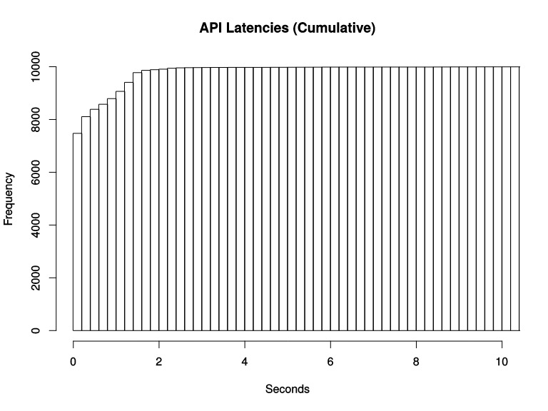

# 直方图 （Histogram）

除了Counter和Gauge类型的监控指标以外，Prometheus还定义了Histogram和Summary的指标类型。Histogram和Summary主要用于统计和分析样本的分布情况。

在大多数情况下人们都倾向于使用某些量化指标的平均值，例如 CPU 的平均使用率、页面的平均响应时间。这种方式的问题很明显，以系统 API 调用的平均响应时间为例：如果大多数 API 请求都维持在100ms的响应时间范围内，而个别请求的响应时间需要5s，那么就会导致某些 WEB 页面的响应时间落到中位数的情况，而这种现象被称为长尾问题。

为了区分是平均的慢还是长尾的慢，最简单的方式就是按照请求延迟的范围进行分组。例如，统计延迟在0~10ms之间的请求数有多少而10~20ms之间的请求数又有多少。通过这种方式可以快速分析系统慢的原因。Histogram 和Summary 都是为了能够解决这样问题的存在，通过 Histogram 和 Summary 类型的监控指标，我们可以快速了解监控样本的分布情况。

本文将详细讲解什么是Histogram。

Histogram 会在一段时间范围内对数据进行采样（通常是请求持续时间或响应大小等），并将其计入可配置的存储桶（bucket）中。

假设我们想监控某个应用在一段时间内的响应时间，最后监控到的样本的响应时间范围为 0s~10s。现在我们将样本的值域划分为不同的区间，即不同的 bucket，每个 bucket 的宽度是 0.2s。

需要注意的点是Prometheus 的 histogram 是一种累积直方图，其实也很好理解：

每个 bucket 的宽度是 0.2s，那么第一个 bucket 表示响应时间小于等于 0.2s 的请求数量，第二个 bucket 表示响应时间小于等于 0.4s 的请求数量，以此类推。也就是说，每一个 bucket 的样本包含了之前所有 bucket 的样本，所以叫累积直方图。


实例：




## 样例

实际数据

```
# HELP ts_http_seconds_bucket web http response time in seconds
# TYPE ts_http_seconds_bucket histogram
ts_http_seconds_bucket_bucket{error="false",method="put",path="/app/tri",serverName="Java-application",stage="beta",statusCode="200",le="1"} 0
ts_http_seconds_bucket_bucket{error="false",method="put",path="/app/tri",serverName="Java-application",stage="beta",statusCode="200",le="2"} 0
ts_http_seconds_bucket_bucket{error="false",method="put",path="/app/tri",serverName="Java-application",stage="beta",statusCode="200",le="4"} 0
ts_http_seconds_bucket_bucket{error="false",method="put",path="/app/tri",serverName="Java-application",stage="beta",statusCode="200",le="8"} 0
ts_http_seconds_bucket_bucket{error="false",method="put",path="/app/tri",serverName="Java-application",stage="beta",statusCode="200",le="16"} 0
ts_http_seconds_bucket_bucket{error="false",method="put",path="/app/tri",serverName="Java-application",stage="beta",statusCode="200",le="32"} 0
ts_http_seconds_bucket_bucket{error="false",method="put",path="/app/tri",serverName="Java-application",stage="beta",statusCode="200",le="64"} 0
ts_http_seconds_bucket_bucket{error="false",method="put",path="/app/tri",serverName="Java-application",stage="beta",statusCode="200",le="128"} 0
ts_http_seconds_bucket_bucket{error="false",method="put",path="/app/tri",serverName="Java-application",stage="beta",statusCode="200",le="512"} 0
ts_http_seconds_bucket_bucket{error="false",method="put",path="/app/tri",serverName="Java-application",stage="beta",statusCode="200",le="1024"} 877
ts_http_seconds_bucket_bucket{error="false",method="put",path="/app/tri",serverName="Java-application",stage="beta",statusCode="200",le="+Inf"} 1062
ts_http_seconds_bucket_sum{error="false",method="put",path="/app/tri",serverName="Java-application",stage="beta",statusCode="200"} 1.19617e+06
ts_http_seconds_bucket_count{error="false",method="put",path="/app/tri",serverName="Java-application",stage="beta",statusCode="200"} 1062
```

以_count作为后缀的指标反映当前指标记录的总数，以_sum作为后缀的指标反映值的总量。

Histogram指标直接反映了在不同区间内样本的个数，区间通过标签le进行定义。

## 分位数的计算

Histogram 本质上是一些桶。举例子说，我们为了计算 P99，可以将所有的请求分成 10 个桶，第一个存放 0-1ms 完成的请求的数量，后面 9 个桶存放的请求耗时上区间分别是 5ms 10ms 50ms 100ms 200ms 300ms 500ms 1s 2s. 这样只要保存 10 个数字就可以了。要计算 P99 的话，只需要知道第 99% 个数字落在了哪一个桶，比如说落在了 300ms-500ms 的桶，那我们就可以说现在的 99% 的请求都在 500ms 之内完成（这样说不太准确，如果准确的说，应该是第 99% 个请求在 300ms – 500ms 之间完成）。这些数据也可以用来计算 P90, P95 等等。

由于我们的监控一般是绘制一条曲线，而不是一个区间。所以 P99 在 300-500 之间是不行的，需要计算出一个数字来。

Prometheus 是假设每一个桶内的数据都是线性分布的，比如说现在 300-500 的桶里面一共有 100 个请求，小于300个桶里面一共有 9850 个请求。所有的桶一共有 1万个请求。那么我们要找的 P99 其实是第 10000 * 0.99 = 9900 个请求。第 9900 个请求在 300-500 的桶里面是第 9900 – 9850 = 50 个请求。根据桶里面都是线性分布的假设，第50个请求在这个桶里面的耗时是 (500 – 300) * (50/100) + 300 = 400ms, 即 P99 就是 400ms.

这里的计算公式是：

```
bucketStart + (bucketEnd-bucketStart)*float64(rank/count)
```

可以注意到因为是基于线性分布的假设，不是准确的数据。比如假设 300-500 的桶中耗时最高的请求也只有 310ms, 得到的计算结果也会是 400ms. *桶的区间越大，越不准确，桶的区间越小，越准确*。

对于Histogram的指标，我们可以通过histogram_quantile()函数计算出其值的分位数。

## histogram_quantile 详解

histogram_quantile(φ float, b instant-vector) 从 bucket 类型的向量 b 中计算 φ (0 ≤ φ ≤ 1) 分位数（百分位数的一般形式）的样本的最大值。向量 b 中的样本是每个 bucket 的采样点数量。每个样本的 labels 中必须要有 le 这个 label 来表示每个 bucket 的上边界，没有 le 标签的样本会被忽略。直方图指标类型自动提供带有 _bucket 后缀和相应标签的时间序列。

可以使用 rate() 函数来指定分位数计算的时间窗口。

例如，一个直方图指标名称为 employee_age_bucket_bucket，要计算过去 10 分钟内 第 90 个百分位数，请使用以下表达式：

```
histogram_quantile(0.9, rate(employee_age_bucket_bucket[10m]))
```
返回：

```
{instance="10.0.86.71:8080",job="prometheus"} 35.714285714285715
```
这表示最近 10 分钟之内 90% 的样本的最大值为 35.714285714285715。

这个计算结果是每组标签组合成一个时间序列。我们可能不会对所有这些维度（如 job、instance 和 method）感兴趣，并希望将其中的一些维度进行聚合，则可以使用 sum() 函数。例如，以下表达式根据 job 标签来对第 90 个百分位数进行聚合：

```
# histogram_quantile() 函数必须包含 le 标签
histogram_quantile(0.9, sum(rate(employee_age_bucket_bucket[10m])) by (job, le))
```

如果要聚合所有的标签，则使用如下表达式：

```
histogram_quantile(0.9,sum(rate(employee_age_bucket_bucket[10m])) by (le))
```

> 需要注意：histogram_quantile 这个函数是根据假定每个区间内的样本分布是线性分布来计算结果值的(也就是说它的结果未必准确)，最高的 bucket 必须是 le="+Inf" (否则就返回 NaN)。

如果分位数位于最高的 bucket（+Inf） 中，则返回第二个最高的 bucket 的上边界。如果该 bucket 的上边界大于 0，则假设最低的 bucket 的的下边界为 0，这种情况下在该 bucket 内使用常规的线性插值。

如果分位数位于最低的 bucket 中，则返回最低 bucket 的上边界。


如果 b 含有少于 2 个 buckets，那么会返回 NaN，如果 φ < 0 会返回 -Inf，如果 φ > 1 会返回 +Inf。


## 参考资料
* https://segmentfault.com/a/1190000019987152
* https://www.jianshu.com/p/ccffd6b9e3d1
* https://jishuin.proginn.com/p/763bfbd680e9
* https://izsk.me/2019/12/28/prometheus-4-types/
* https://fuckcloudnative.io/prometheus/3-prometheus/functions.html
* https://www.kawabangga.com/posts/4284