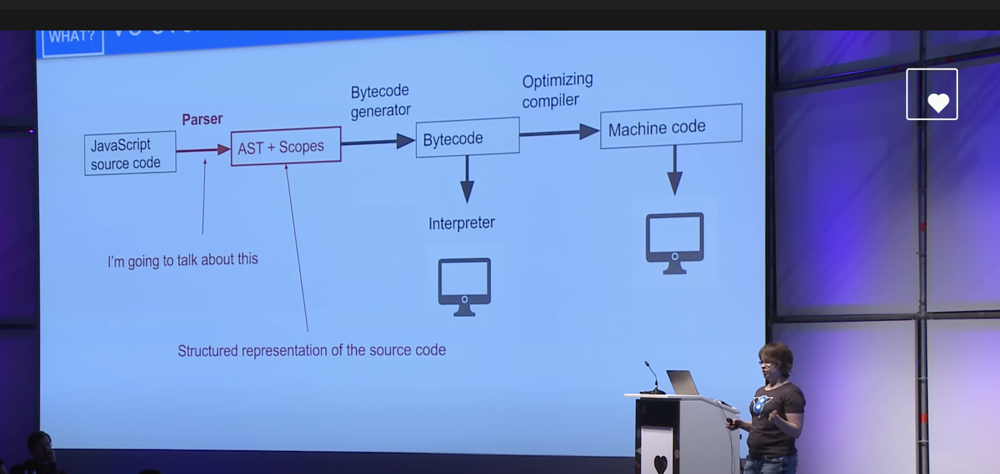

# Javascript 的解析过程

javascript 从被下载到执行这个过程中发生了什么，本篇我们来一探究竟。

<!--  -->

js 引擎负责将js代码编译为机器码并最终执行，主流浏览器都实现了自己的js引擎，像Chrome v8、
Safari JavaScriptCore、Firefox SpiderMonkey。

这里以Chrome为例，看看js的整个编译和执行过程。

## Parse （解析）

javascript 被下载到浏览器本地以后，以文本的形式被解析，这个过程分为两个阶段。

### 词法分析
[The scanner](https://github.com/v8/v8/blob/master/src/parsing/scanner.h) 将js文件解析成一系列的tokens

### 语法分析

[The parser](https://github.com/v8/v8/blob/master/src/parsing/parser.h) 将上一步生成的Tokens，
进一步生成Abstract Syntax Tree (AST)，也就是抽象语法树，

## Interpreter （解释器）

V8 使用 [Ignition](https://github.com/v8/v8/blob/master/src/interpreter/interpreter.h)解释器，它会将AST转换成bytecode（字节码）

## Execution（执行）

## Compiler（编译）

优化字节码并进行优化，最终产生机器码。

AST全称（Abstract syntax tree）翻译过来就是抽象语法树，

那些抽象语法树长什么样子呢，大家可以去[AST Explorer](https://astexplorer.net/)进行体验。
## 什么是AST

## 为什么不预备编译

Precompiling JavaScript?
Every few years, it’s proposed engines offer a way to precompile scripts so we don’t waste time parsing or compiling code pops up. The idea is if instead, a build-time or server-side tool can just generate bytecode, we’d see a large win on start-up time. My opinion is shipping bytecode can increase your load-time (it’s larger) and you would likely need to sign the code and process it for security. V8’s position is for now we think exploring avoiding reparsing internally will help see a decent enough boost that precompilation may not offer too much more, but are always open to discussing ideas that can lead to faster startup times. That said, V8 are exploring being more aggressive at compiling and code-caching scripts when you update a site in a Service Worker and we hope to see some wins with this work.

## ast 实践
https://segmentfault.com/a/1190000016231512

## AST 的简单实现

https://github.com/jamiebuilds/the-super-tiny-compiler
## 资料收集

1. [How JavaScript works: Parsing, Abstract Syntax Trees (ASTs) + 5 tips on how to minimize parse time](https://blog.sessionstack.com/how-javascript-works-parsing-abstract-syntax-trees-asts-5-tips-on-how-to-minimize-parse-time-abfcf7e8a0c8)
3. [Abstract syntax tree](https://en.wikipedia.org/wiki/Abstract_syntax_tree)
4. [AST Explorer](https://astexplorer.net/)
5. [How to implement a programming language in JavaScript](http://lisperator.net/pltut/)
6. [JavaScript Engines: An Overview](https://blog.bitsrc.io/javascript-engines-an-overview-2162bffa1187)
7. [How JavaScript Works: Under the Hood of the V8 Engine](https://www.freecodecamp.org/news/javascript-under-the-hood-v8/)
8.  [the-super-tiny-compiler](https://github.com/jamiebuilds/the-super-tiny-compiler)
9.  [JavaScript engine fundamentals: Shapes and Inline Caches](https://mathiasbynens.be/notes/shapes-ics)
10. [Deep Dive in to JavaScript Engine - (Chrome V8)](https://dev.to/edisonpappi/how-javascript-engines-chrome-v8-works-50if)