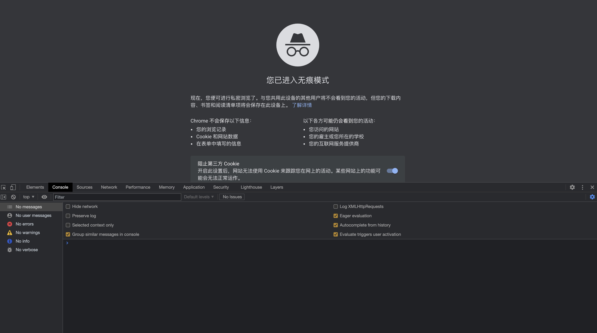

# ```Chrome``` 开发工具使用

```Chrome``` 以良好的兼容性和方便的调试功能深受广大前端开发者的青睐，本篇将会详细的介绍```Chrome```开发者工具的使用，希望对各位有所帮助。全文使用```Chrome 91```， 不同版本的功能和UI可能会有些出入，但是基本功能都是差不多的。


## 概览

打开开发者工具，快捷键 ```Command+Option+I (Mac)``` 或者 ```Control+Shift+I```.


从左到右功能：
* 选择元素
* 模拟手机屏幕 
* Elements： 查看DOM和CSS，可以进行修改
* Console：可以执行js，查看信息。
* Sources：调试js，打断点，保存修改等。
* Network： 查看请求的返回。
* Performance： 测试网站的性能，可根据结果做针对性的优化处理
* Memory // TODO:
* Application // TODO:
* Security：调试混合内容问题、证书问题


## 打开方式和常用快捷键

* ```Command+Option+C (Mac)``` 、 ```Control+Shift+C (Windows, Linux, Chrome OS)```，打开```Elements```面板。或者右键选择```Inspect(检查)```
* ```Command+Option+J (Mac)``` 、 ```Control+Shift+J (Windows, Linux, Chrome OS)```，打开```Console```面板。
* ```Command+Option+I (Mac)``` 、 ```Control+Shift+I (Windows, Linux, Chrome OS)```，打开最后一次打开过的面板。
* Mac: ```/Applications/Google\ Chrome.app/Contents/MacOS/Google\ Chrome --auto-open-devtools-for-tabs```打开Chrome并且每新开一个tab都是自动打开开发者工具。TODO: //

## 调试CSS


## 参考资料
1. [Chrome DevTools](https://developer.chrome.com/docs/devtools/overview/)