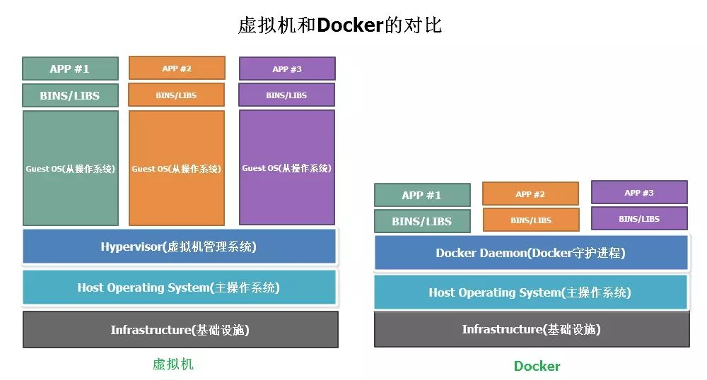

# Docker 浅尝辄止

本文将从Docker是什么，如何使用Docker，项目实践几个方面来介绍Docker


## Docker是什么


### Docker概念


如同 Docker 的 Logo 一样，Docker 的思想来源于集装箱。集装箱解决了什么问题？在一艘大船上，可以把货物规整的摆放起来，并且各种各样的货物被集装箱标准化，集装箱与集装箱之间互不影响。那么就不需要专门运送水果的船和专门运送化学用品的船了。只要这些货物封装在不同的集装箱里，就可以用一艘大船把它们都运走。

回到实际运用中来，服务器就像是一艘大船，docker 就是集装箱。不同的应用程序会有不同的运行环境依赖，我们把这些环境依赖打包进不同的docker容器中，容器与容器之间独立存在，互不影响。


这里不得不提到虚拟机技术。虚拟机技术同样可以实现隔离，那它与docker有什么区别呢。



这里对比两者之间的差异，虚拟机通过在操作系统上建立了一个中间虚拟软件层 Hypervisor ，并利用物理机器的资源虚拟出多个虚拟硬件环境来共享宿主机的资源，其中的应用运行在虚拟机内核上。虚拟机的一个缺点在于Guest OS通常会占用不少硬件资源。就算不运行任何应用程序也需要占用一定的内存和硬盘空间，而且为了运行程序的性能，往往还要给每台虚拟机预留出一些内存空间以供消耗。

相对于虚拟机，Docker省去了虚拟机操作系统（Guest OS），Docker守护进程可以直接与主操作系统进行通信，Docker会直接使用宿主机的硬件资源,为各个Docker容器分配资源，从而节省了一部分的系统资源。


对比虚拟机Docker的优缺点：

**优点：**
* 没有虚拟机硬件的初始化，没有Guest OS的启动过程，可以节约很多启动时间
* 没有运行Guest OS所需的内存开销，无需为虚拟机预留运行内存，无需安装、运行App不需要的运行库/操作系统服务，内存占用、存储空间占用都小的多。

**缺点：**

* 应用之间的隔离不如虚拟机彻底，如果某个应用运行时导致内核崩溃，所有的容器都会崩溃。


1. [docker 是什么](https://www.zhihu.com/question/28300645)
2. [Docker和虚拟机的对比](https://www.cnblogs.com/jie-fang/p/10279629.html)


### Docker 架构


docker 采用客户端（client）服务器（docker deamon）架构，使用REST API进行通信。

#### Docker 镜像（Docker images）

Docker镜像是创建Docker container的只读模版。


#### Docker 容器（Docker container）
container是镜像的可运行实例。c

#### Docker守护进程（The Docker da。emon）
Docker守护进程监听Docker Api请求，负责管理docker对象（images、containers、networks、volumes），构建、运行和分发Docker容器。


#### Docker客户端（The Docker client）

用户通过Docker客户端与Docker守护进程进行交互，用户在控制台中输入Docker命令，Docker客户端将命令发送给Docker守护进程，Docker命令最终调用Docker API。


#### Docker仓库（Docker registries）

Docker仓库存储Docker镜像，默认的仓库地址是Docker Hub，可以配置自己的私有Docker仓库。


## 如何使用docker

docker如何安装就不讲解了，安装过程可以参考[官方文档](https://docs.docker.com/get-started/)

### 运行第一个Docker container

运行一个hello world镜像，

```bash
$ docker container run hello-world
```


现在我们已经运行了我们的第一个Docker应用，就是这么简单，命令行还打印出了生成这条信息,Docker用了哪些步骤，这里简单分析一下:


1. 首先Docker客户端与Docker守护进程建立通信。
2. Docker会在本地查找hello-world镜像，发现没有找到，此时docker会自动帮我们执行docker pull hello-world 从Docker Hub上拉取，将远程仓库的镜像拉取到本地
3. 有了镜像以后Docker守护进程会自动帮我们执行docker container create命令来创建container，并且运行container
4. Docker守护进程将结果给到Docker客户端，客户端再发送到终端。


### 如何创建image

这里以官方文档中[demo](https://docs.docker.com/language/nodejs/build-images/)讲解如何构建我们自己的镜像

首先我们需要创建自己的应用。

 1. 创建项目
```bash
mkdir node-docker && cd node-docker && npm init -y &&  npm install ronin-server ronin-mocks && touch server.js
```

2. 修改server.js

```js
const ronin     = require( 'ronin-server' )
const mocks     = require( 'ronin-mocks' )

const server = ronin.server()

server.use( '/', mocks.server( server.Router(), false, true ) )
server.start()
```

3. 启动项目

```js
$ node server.js
```

4. 测试一下是否运行正常

```bash
$ curl --request POST \
  --url http://localhost:8000/test \
  --header 'content-type: application/json' \
  --data '{"msg": "testing" }'
{"code":"success","payload":[{"msg":"testing","id":"31f23305-f5d0-4b4f-a16f-6f4c8ec93cf1","createDate":"2020-08-28T21:53:07.157Z"}]}

$ curl http://localhost:8000/test
{"code":"success","meta":{"total":1,"count":1},"payload":[{"msg":"testing","id":"31f23305-f5d0-4b4f-a16f-6f4c8ec93cf1","createDate":"2020-08-28T21:53:07.157Z"}]}

```

输入日志：

```bash
2021-05-30T17:39:41:1940  INFO: POST /notes
2021-05-30T17:40:28:8770  INFO: GET /notes
```

说明一切运行正常。

现在我们开始动手将我们的应用build成一个docker镜像。

#### 创建Dockerfile

在项目根目录下创建Dockerfile文件，

```Dockerfile
# syntax=docker/dockerfile:1

# 基础镜像
FROM node:12.18.1

# 为了提升性能将NODE_ENV设置为production
ENV NODE_ENV=production

# 指定工作目录，后续所有的操作都在这个目录下进行
WORKDIR /app

# 将项目的package.json、package-lock.json拷贝到工作目录下，以便执行npm install安装依赖
COPY ["package.json", "package-lock.json*", "./"]

# 执行npm install安装所有依赖
RUN npm install --production

# 将项目代码拷贝到工作目录
COPY . .

# 当镜像的container运行时执行这个命令，这样我们的服务就启动了。
# 区别于RUN命令，RUN命令实在生成image时执行的
CMD [ "node", "server.js" ]
```

#### 创建.dockerignore

在执行COPY命令的时候我们不希望将node_modules，.git文件拷贝到镜像中来，我们可以创建.dockerignore 将这两个文件加进去。

```file
.git
node_modules
```

#### 构建镜像

现在所有的准备工作都做好了，我们可以开始构建镜像了。

执行命令：

```bash
docker build --tag node-docker .
```

执行这个命令Docker会读取dDockerfile里面指令并逐个执行它们，最终创建一个Docker映像。

#### 运行container

构建好image后我们就可以运行containr了，
执行命令：
```bash
docker run -d -p 8000:8000 node-docker
```

- -d 是--detach的缩写，表示在后台运行container不会占用命令行
- -p 是--publish缩写，将容器里面的端口暴露给宿主机，[host port]:[container port]

执行完这个命令后我们的container已经运行起来了，我们可以用上面的POST和GET请求进行验证。因为container在后台运行，我们没法直接看到日志打出，可以使用命令   ```docker logs [containerId] 进行查看。


#### 更新应用操作

现在我们在server.js加入一行log
```js
...
console.log("this is a new image");
...
```

那么本次改动如何更新到镜像和container中？

* 重新build image，```docker build --tag node-docker .```
* 删除之前的container，```docker rm -f [containerId]```
* 重新运行container，```docker run -dp 8000:8000 node-docker```


#### 共享image
现在我们已经构建好了自己的镜像，我们可以发布到远程仓库中以供他人下载和使用,

这里我们使用Docker Hub来共享我们image，

* 首先我们需要[注册](https://www.docker.com/pricing?utm_source=docker&utm_medium=webreferral&utm_campaign=docs_driven_upgrade)和[登录]()Docker Hub
* 点击 “Create Repository”按钮创建一个我们自己的仓库，取名就叫node-server，创建成功后我们可以得到新的镜像名字，[YOUR-USER-NAME]/node-server。
* 我们需要在本地登录Docker Hub，```docker login -u YOUR-USER-NAME```。
* 我们需要给我们的镜像重新取一个跟远程一样的名字，```docker tag node-serve YOUR-USER-NAME/node-server``` 这里不会创建新的镜像，执行```docker images```命令可以看到```IMAGE ID```是相同的。
* 现在我们可以将我们的镜像推送到远程了，执行命令```docker push YOUR-USER-NAME/node-server```, 执行完已经刷新Docker Hub页面就可以看到我们刚刚的推送了。

这样别人就可以拉取到我们的镜像了。


#### 数据持久化（volume）

在上面的demo中，我们用post请求存储的数据存在内存中，前文也讲过docker container拥有自己独立的文件系统并且与外界隔离，container可以完成文件的增删改查操作，
那么当container被删除后，container里面的数据也会被一并删除。那么docker里面怎么做数据的持久化存储呢。这里就引入了volume的概念。

volume可以将container中的文件路径挂载到宿主机的某个路径上面，那么container中那个路径下的所有改动都会映射到宿主机上对应的路径中，它的生命周期独立于容器，Docker不会在容器被删除后自动删除volume。


volume 主要分为两种:


##### 1. bind mounts

我们需要自己指定挂载目录，也可以用来做的数据存储，不过通常用来给container提供额外的数据。比如将项目的源代码挂载到container里面，

修改源代码就可以同步到container里面。

```bash
docker run -dp 3000:3000 \
     -w /app -v "$(pwd):/app" \
     node:12-alpine \
     sh -c "yarn install && yarn run dev"
```


*========运行demo=============*


开发完后我们就可以重新打包我们的镜像了。


##### 2. named volume 

named volume适用于数据存储，我们不用关心数据的存储位置。创建好named volume后，我们只需要使用volumeName用作挂载，
docker 会自动给volume分配存储路径。

```bash
# 创建named volume 
$ docker volume create [volumeName]
```

```bash
 docker run  -v [volumeName]:/etc/todos [imageName]
```

那我们怎么查看named volume在宿主机上的挂载路径呢，很简单使用命令：

```bash
docker volume inspect [volumeName]
```


#### container 之间如何通信

目前为止我们只有一个container在运行，但是在实际使用中服务往往不止一个，比如数据库服务，api服务等，

为了方便管理和维护，我们将服务分到不同的container中，每个container只做好一件事情，

在同一个局域网中,container之间可以通过networking进行通信。


```bash
$ docker network create [networkName]
```


#### 改造我们的应用
这里我们综合使用volume和networking来改造我们的应用。我们将引入数据库（mongodb）用来存储我们的数据。

首先我们创建两个volume用来存储mongodb的数据和配置

```bash
$ docker volume create mongodb
$ docker volume create mongodb_config
```

创建一个network用于server和mongodb进行通讯。

```bash
$ docker network create mongodb
```
好了现在我们可以运行我们的mongodb镜像了，这里我们直接从Docker Hub上拉取
mongodb镜像，将我们创建好的volume挂载上去，同时将mongodb接入到我们创建的network中。

```bash
$ docker run -it --rm -d -v mongodb:/data/db \
  -v mongodb_config:/data/configdb -p 27017:27017 \
  --network mongodb \
  --name mongodb \
  mongo
```

修改我们的server.js 代码，使其连接到Mongodb

```js
const ronin     = require( 'ronin-server' )
const mocks     = require( 'ronin-mocks' )
const database  = require( 'ronin-database' )
const server = ronin.server()

database.connect( process.env.CONNECTIONSTRING )
server.use( '/', mocks.server( server.Router(), false, false ) )
server.start()
```

这里引入了ronin-database需要安装

```bash
$ npm install ronin-database
```


现在重新编译我们镜像：
```bash
$ docker build --tag node-docker .
```

镜像编译完成就可以运行我们的container了

```bash
$ docker run \
  -it --rm -d \
  --network mongodb \
  --name rest-server \
  -p 8000:8000 \
  -e CONNECTIONSTRING=mongodb://mongodb:27017/yoda_notes \
  node-docker
```

这里我们将container接入到相同的网络mongodb中，这样应用就可以和mongodb相互通信了。
注入环境变量CONNECTIONSTRING，server.js 连接数据库需要用到。

现在让我们来测试一下：

```bash
$ curl --request POST \
  --url http://localhost:8000/notes \
  --header 'content-type: application/json' \
  --data '{
"name": "this is a note",
"text": "this is a note that I wanted to take while I was working on writing a blog post.",
"owner": "peter"
}'
```

获取一下我们刚才存储的数据

```bash
curl --request GET --url http://localhost:8000/notes
```

大功告成。后面就算将mongodb的container删除，只要在启动的时候将volume挂载上去，数据还是一直存在的。

## 使用docker compose 打包你的应用

到目前为止我们已经了解了docker的基本概念，学会了如何使用docker。

但是我们也发现了，整个过程还是比较繁琐的，我们需要创建network，创建volume，启动container，注入环境变量等等操作，

那有没有办法一行命令搞定所有这些事情呢，答案是肯定的。现在我们就来介绍docker compose的使用让我们一次搞定所有这些步骤。


## 创建image的最佳实践
https://docs.docker.com/get-started/09_image_best/


## 最后我们再来总结一下docker的一些特点


## Docker 常用命令总结

```bash
# 查看所有运行中的container
$ docker ps 
# 查看所有container
$ docker ps -a
# 停止所有容器
$ docker stop $(docker ps -aq)
# 删除所有容器
$ docker rm $(docker ps -aq)
# 删除所有镜像
$ docker rmi $(docker images -q)
```