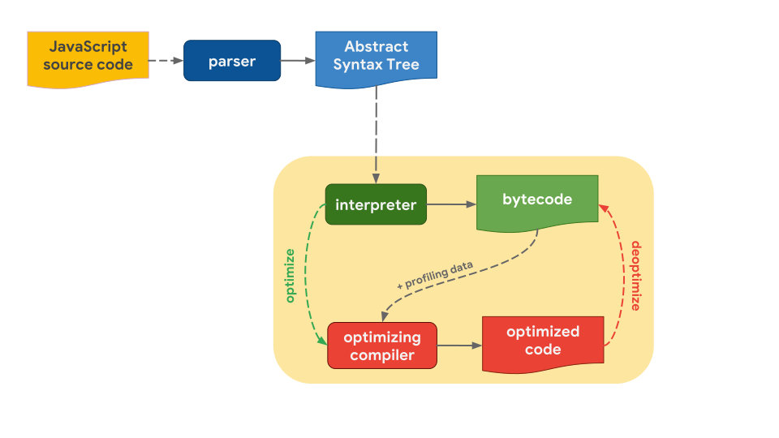
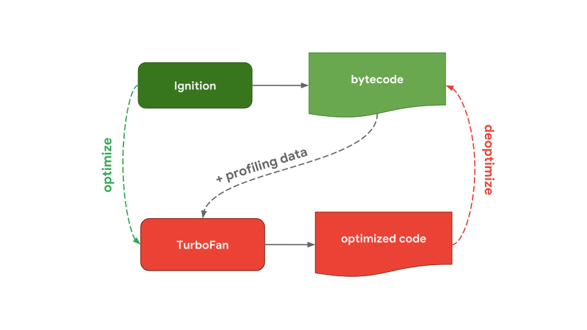
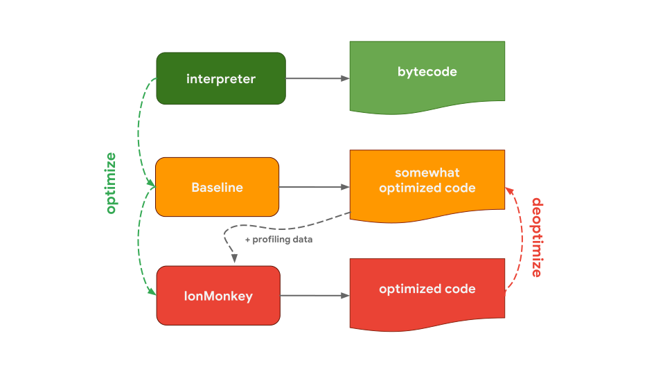
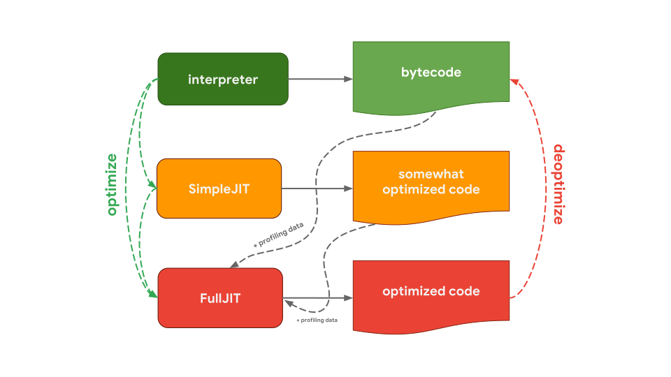

# Javascript在V8中的执行过程详解

作为前端开发了解js引擎对js的处理过程，理解并掌握js的执行过程是非常有必要的。本篇将从js引擎的工作原理讲起，一步一步深入到js的执行过程。

## js引擎的工作原理



1. 将js代码解析为ATS（抽象语法树）
2. 基于AST，解释器（interpreter ）将抽象语法树转化为字节码（bytecode），这一步js引擎实际上已经在执行js代码了。
3. 为了让js代码运行得更快，字节码加上一些分析数据给到优化编译器（optimizing compiler），优化编译器基于分析数据对字节码做进一步的优化处理，生成机器码（machine code）
4. 如果在优化过程中出现了什么问题，优化编译器会将字节码复原然后返还给解释器。
   

### 各大主流浏览器js引擎对比

各大浏览器的js引擎基本都包含了上述的处理过程，解释器负责快速的生成没有优化过的字节码，优化编译器负责生成优化过后的机器码但是相对来说花的时间会长一些。不同js引擎的优化过程和策略会有一些区别。

### V8引擎



V8 引擎用于Chrome和NodeJs中。V8的解释器叫做ignition，负责产生和执行字节码。ignition在执行字节码的过程中会收集分析数据用于后续的优化。例如当一个函数经常被调用执行，V8就认为这个函数变得hot (比较形象)，这个时候字节码和分析数据就被传递给优化编译器做进一步的优化的处理。V8的优化编译器叫做TurboFan，根据分析数据产生告诉优化的机器码。

### SpiderMonkey引擎

 

SpiderMonkey是Mozilla的js引擎，用于Firefox 和 [SpiderNode](https://github.com/mozilla/spidernode)。 SpiderMonkey处理方式稍微不同，它有两个优化编译器。解释器将字节码传递给Baseline编译器，Baseline编译器会优化部分代码并执行代码，执行过程中会产生分析数据。结合分析数据IonMonkey编译器会生成高度优化的代码。如果优化失败，IonMonkey会将代码回滚到Baseline产生的代码。

### Chakra引擎



Chakra 是微软的js引擎，用于Edge和[Node-ChakraCore](https://github.com/nodejs/node-chakracore)。Chakra 同样也有两个优化编译器。解释器将代码交给SimpleJIT编译器，SimpleJIT做部分优化。结合分析数据FullJIT编译器会生成高度优化的代码。如果优化失败，FullJIT会将代码回滚到编译器产生的代码。

### JavaScriptCore引擎


JavaScriptCore（缩写JSC），是苹果的js引擎用于Safari和React Native。JSC为了优化代码引入了三个优化编译器。LLInt解释器 （the Low-Level Interpreter） 将代码交给Baseline编译器，Baseline优化过后将代码交给DFG (Data Flow Graph)编译器，最后将代码交给FTL (Faster Than Light) 编译器。


通过对比其实不难发现，js引擎的整体架构基本都是相同的，都是 parser -> interpreter -> compiler。 那为什么有些只有一个优化编译器而有些又有多个呢？其实这中间是要做权衡的。解释器（interpreter）能够快速的生成可执行的代码，但是代码的执行效率不高。编译器呢需要多花些时间来做编译优化，但是最后生成的是可以高效执行的机器码。所以这里就涉及到一个取舍的问题，到底是要```快速生成并执行```还是要 ```多花些时间生成并高效执行```，一些引擎引入多个具有不同时间/效率特性的优化编译器，以增加复杂性为代价，就是为了对这些取舍做更细粒度的控制。这中间还涉及到内存的权衡，机器码比字节码会占用更多的内存，后续会讲到。


## 参考资料
* [JavaScript engine fundamentals: optimizing prototypes](https://mathiasbynens.be/notes/prototypes)
* [JavaScript engine fundamentals: optimizing prototypes](https://mathiasbynens.be/notes/prototypes#tradeoffs)
  

* [How JavaScript works: an overview of the engine, the runtime, and the call stack](https://blog.sessionstack.com/how-does-javascript-actually-work-part-1-b0bacc073cf)
* [What the heck is the event loop anyway? | Philip Roberts | JSConf EU](https://www.youtube.com/watch?v=8aGhZQkoFbQ)
* [Await and Async Explained with Diagrams and Examples](https://nikgrozev.com/2017/10/01/async-await/)
1. [How JavaScript works: Event loop and the rise of Async programming + 5 ways to better coding with async/await](https://blog.sessionstack.com/how-javascript-works-event-loop-and-the-rise-of-async-programming-5-ways-to-better-coding-with-2f077c4438b5)
2. [从浏览器多进程到JS单线程，JS运行机制最全面的一次梳理](https://juejin.cn/post/6844903553795014663#comment)
3. [JavaScript Engines: An Overview](https://blog.bitsrc.io/javascript-engines-an-overview-2162bffa1187)
4. [How JavaScript Works: Under the Hood of the V8 Engine](https://www.freecodecamp.org/news/javascript-under-the-hood-v8/)
5. [How JavaScript works: the rendering engine and tips to optimize its performance](https://blog.sessionstack.com/how-javascript-works-the-rendering-engine-and-tips-to-optimize-its-performance-7b95553baeda)
